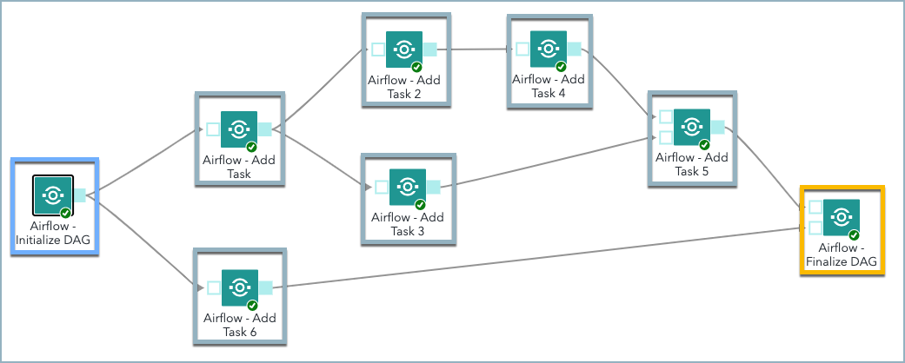
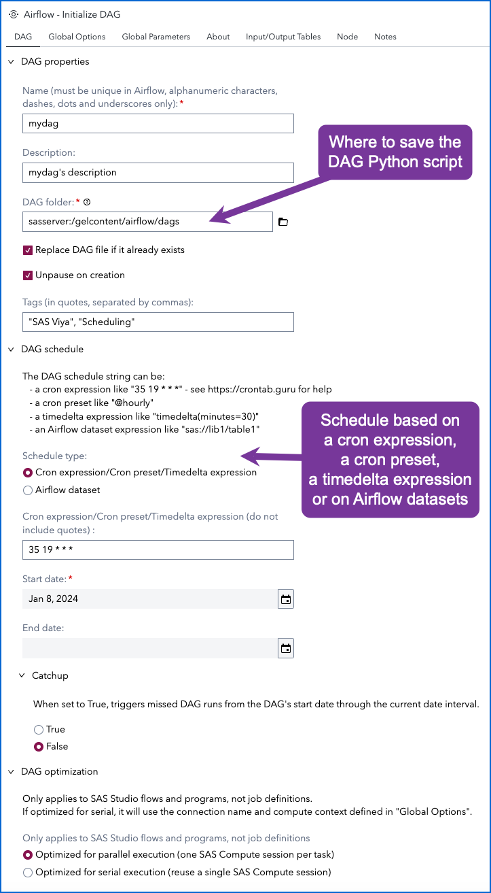
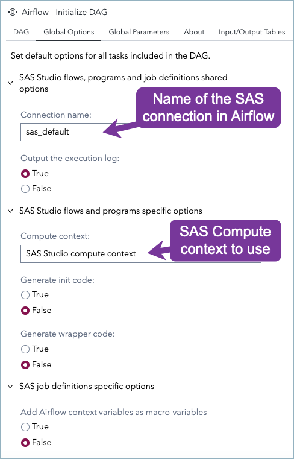
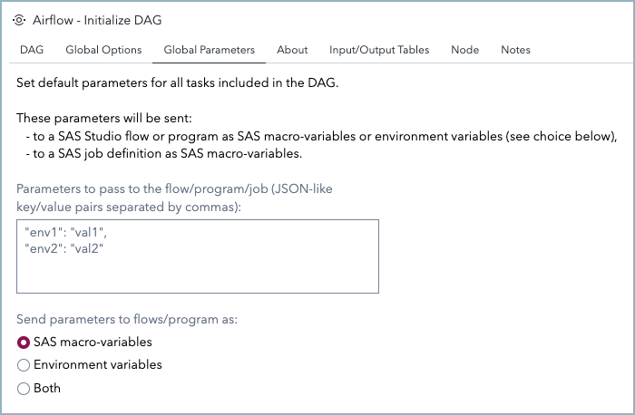
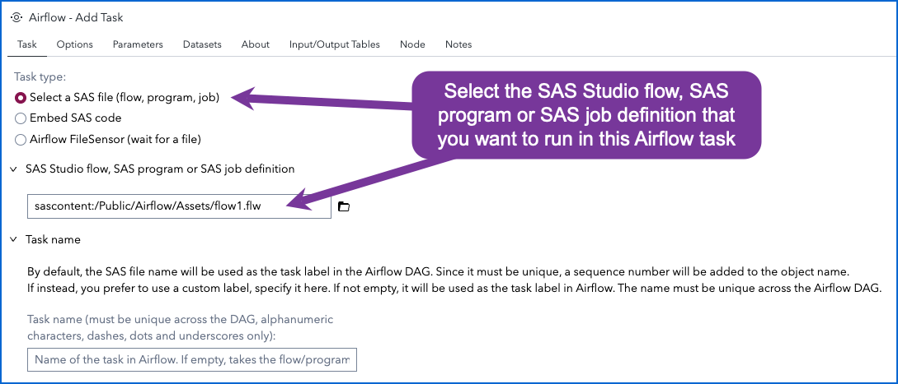
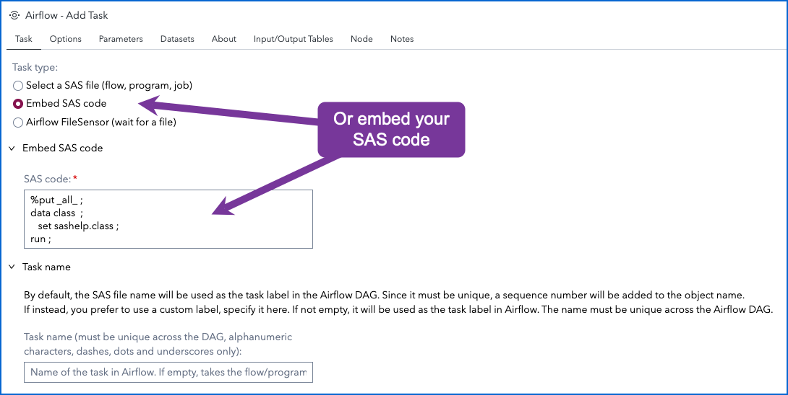
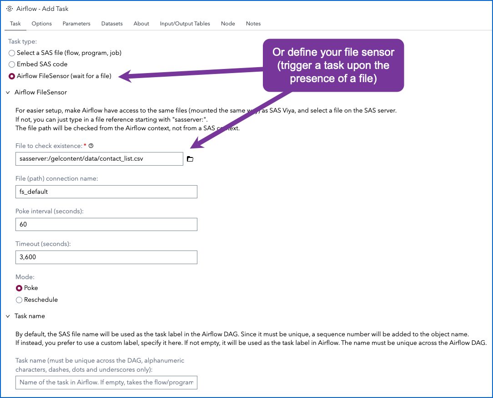
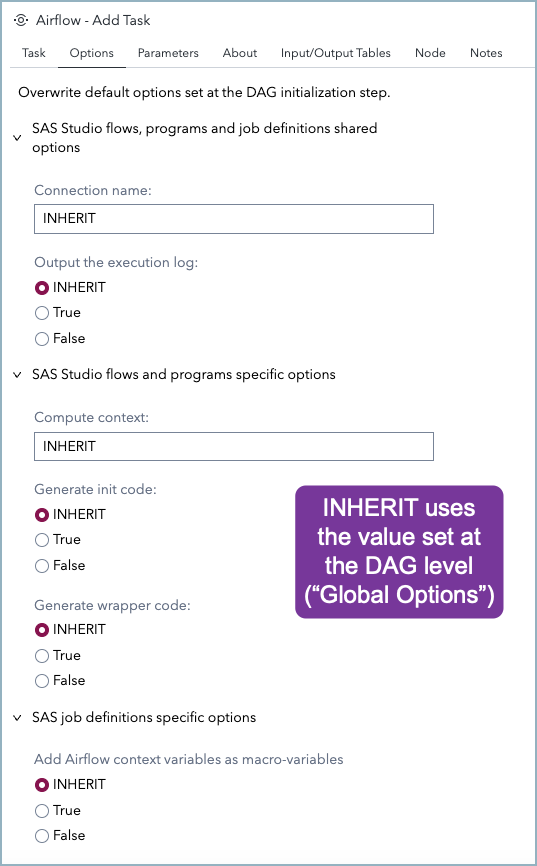
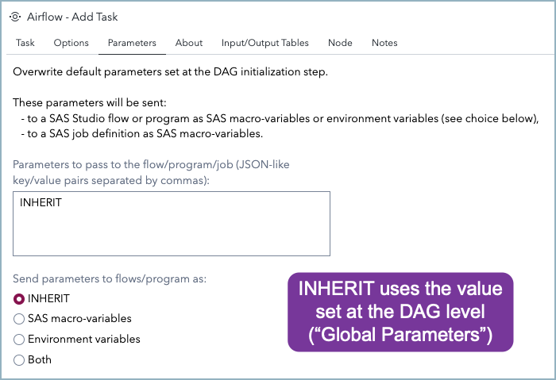
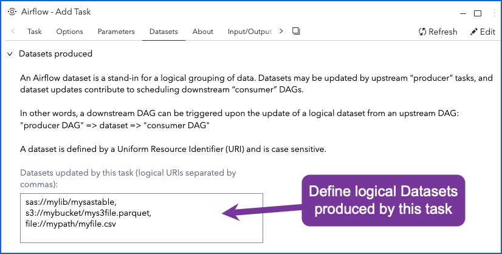

# Generate Airflow DAG

## Description

The "**Airflow - Generate DAG**" tool is a set of three Custom Steps that enables SAS Studio Flow users to create an **Airflow DAG** (Directed Acyclic Graph) directly from a SAS Studio Flow, by including and orchestrating **SAS Studio Flows**, **SAS Programs** and **SAS Job Definitions**. You can also defined **File Sensors** from these tools to trigger a task based on the presence of a file. The generated Airflow DAG contains references to Airflow providers that are part of the [SAS Airflow Provider](https://github.com/sassoftware/sas-airflow-provider).

"***In Airflow, a DAG is a collection of all the tasks you want to run, organized in a way that reflects their relationships and dependencies.***

***A DAG is defined in a Python script, which represents the DAGs structure (tasks and their dependencies) as code.***"

The three steps used together allow the creation of the Python script that represents a DAG. The Python script needs to be copied in Airflow's DAG folder.

> You could describe it as an example of a no-code/low-code alternative to manually writing those Python scripts, when you only want to use SAS Airflow providers in your DAG.

> :warning: It shows that the combination of SAS Studio flows and Custom Steps can also be used to generate Apache Airflow DAGs instead of generating data transformation flows.

See below for an example of a Python script that defines a DAG.

## What's New?

See [Change Log and Requirements](#change-log-and-requirements).

## Requirements

* SAS Viya: 2023.12 or later
* SAS Airflow Provider: 0.0.12 or later

## User Interface

These three custom steps must be used in "Flow" mode. They are not designed to work in "Standalone" mode.

### Setup

The creation of a proper DAG from these 3 custom steps relies on the following principles:

* One SAS Studio Flow creates one DAG by writing a Python script required by Airflow
* There is only ONE "**Airflow - Initialize DAG**" step per flow
* There is at least one and potentially many "**Airflow - Add Task**" steps per flow
* There is only ONE "**Airflow - Finalize DAG**" step per flow
* "**Airflow - Initialize DAG**" must be the first step, doesn't accept any input, accepts one or more outputs
* "**Airflow - Add Task**" must have at least one input and one output even if it is the first task of a DAG or the last (if first or last then they have to be linked to "Initialize" or "Finalize")
* "**Airflow - Add Task**" allows a user to choose a Studio flow, a SAS program, a job definition, to write his own code or to define a File Sensor
* "**Airflow - Add Task**" can have multiple inputs and multiple outputs
* "**Airflow - Finalize DAG**" must be the last step, accepts one or more inputs, doesn't accept any output
* The sequence of tasks (Studio flows, SAS programs, embedded code and/or job definitions) will be reflected in the Airflow DAG
* All steps in the flow are linked together

SAS Studio Flow creating an Airflow DAG Example:



Corresponding DAG in Airflow:


### "Airflow - Initialize DAG" Step

#### DAG Tab

Main properties of the DAG:



#### Global Options tab

Global options for all tasks in the DAG:



#### Global Parameters tab

Global parameters for all tasks in the DAG:



### "Airflow - Add Task" Step

#### Task tab

Main properties of the task:







#### Options tab

Local options for this task:



#### Parameters tab

Local parameters for this task:



#### Datasets tab

Datasets updated/produced by this task (helpful to define DAGs inter-dependencies):



### "Airflow - Finalize DAG" Step

There is nothing to set in the "Airflow - Finalize DAG" step.

## Usage


## Change Log and Requirements

| Version | Date      | Updates                                                                            | Built on SAS Viya | SAS Airflow Provider Release |
| ------- | --------- | ---------------------------------------------------------------------------------- | ----------------- | ---------------------------- |
| 1.5     | 21FEB2024 | Support for Airflow Trigger Rules as part of the task definition                   | Stable 2023.12    | 0.0.12                       |
|         |           | &nbsp;(idea from Charalampos Kamvysis)                                             |                   |                              |
| 1.4     | 09JAN2024 | Support for Airflow File Sensors as part of the task definition                    | Stable 2023.12    | 0.0.12                       |
|         |           | &nbsp;(contribution from Lorenzo Toja)                                             |                   |                              |
|         |           | Support of Airflow Datasets for scheduling                                         |                   |                              |
|         |           | &nbsp;- ability to define logical Datasets on tasks                                |                   |                              |
|         |           | &nbsp;- ability to schedule a DAG upon the update of Datasets                      |                   |                              |
|         |           | Support of cron presets for scheduling                                             |                   |                              |
|         |           | Support of timedelta expressions for scheduling                                    |                   |                              |
|         |           | Support "Unpause on creation" to create an active DAG                              |                   |                              |
|         |           | Proper deletion of the Compute session when reusing a session                      |                   |                              |
|         |           | &nbsp;(SERIAL mode)                                                                |                   |                              |
| 1.3     | 30AUG2023 | New features provided by latest SAS Airflow Provider Release                       | Stable 2023.07    | 0.0.7                        |
|         |           | Run SAS programs, embed SAS code, reuse SAS compute sessions,                      |                   |                              |
|         |           | &nbsp;provide macro-variables, provide Airflow context variables, etc.             |                   |                              |
| 1.2     | 26JUL2023 | Page rearrangement                                                                 | Stable 2023.07    | 0.0.5                        |
| 1.1     | 05APR2023 | UI standardization                                                                 | Stable 2023.03    | 0.0.1                        |
|         |           | DAG and task name validation                                                       |                   |                              |
| 1.0     | 31MAR2023 | Initial version                                                                    | Stable 2023.03    | 0.0.1                        |

## Installation

Download the latest three [Airflow - Generate DAG](./extras/Airflow_Generate_DAG_v1.5.zip) custom steps. Unzip it and upload them in a SAS Content Folder.

See [older versions](./extras/).

## Sample Airflow DAG

```python
# Licensed to the Apache Software Foundation (ASF) under one
# or more contributor license agreements.  See the NOTICE file
# distributed with this work for additional information
# regarding copyright ownership.  The ASF licenses this file
# to you under the Apache License, Version 2.0 (the
# "License"); you may not use this file except in compliance
# with the License.  You may obtain a copy of the License at
#
#   http://www.apache.org/licenses/LICENSE-2.0
#
# Unless required by applicable law or agreed to in writing,
# software distributed under the License is distributed on an
# "AS IS" BASIS, WITHOUT WARRANTIES OR CONDITIONS OF ANY
# KIND, either express or implied.  See the License for the
# specific language governing permissions and limitations
# under the License.

from datetime import datetime
from airflow import DAG, Dataset
from sas_airflow_provider.operators.sas_studioflow import SASStudioFlowOperator
from sas_airflow_provider.operators.sas_jobexecution import SASJobExecutionOperator

dag = DAG(dag_id="mydag",
          description="mydag's description",
          start_date=datetime(2023,3,27),
          tags=["demo","SAS Viya"],
          catchup=False)

task1 = SASStudioFlowOperator(task_id="1_create_table1.flw",
                              flow_path_type="content",
                              flow_path="/Public/flows/create_table1.flw",
                              compute_context="SAS Studio compute context",
                              connection_name="sas_default",
                              flow_exec_log=True,
                              flow_codegen_init_code=False,
                              flow_codegen_wrap_code=False,
                              dag=dag)

task2 = SASStudioFlowOperator(task_id="2_createtable6.flw",
                              flow_path_type="content",
                              flow_path="/Public/flows/cre?ate t#abl!e 6.flw",
                              compute_context="SAS Studio compute context",
                              connection_name="sas_default",
                              flow_exec_log=True,
                              flow_codegen_init_code=False,
                              flow_codegen_wrap_code=False,
                              dag=dag)

task3 = SASStudioFlowOperator(task_id="3_create_table2.flw",
                              flow_path_type="content",
                              flow_path="/Public/flows/create_table2.flw",
                              compute_context="SAS Studio compute context",
                              connection_name="sas_default",
                              flow_exec_log=True,
                              flow_codegen_init_code=False,
                              flow_codegen_wrap_code=False,
                              dag=dag)

task4 = SASStudioFlowOperator(task_id="4_very_long_name_flow4.flw",
                              flow_path_type="content",
                              flow_path="/Public/flows/very_long_name_flow4.flw",
                              compute_context="SAS Studio compute context",
                              connection_name="sas_default",
                              flow_exec_log=True,
                              flow_codegen_init_code=False,
                              flow_codegen_wrap_code=False,
                              dag=dag)

task5_params = {
   "env1": "val1"
}

task5 = SASJobExecutionOperator(task_id="5_etl3",
                              job_name="/Public/jobs/etl3",
                              connection_name="sas_default",
                              parameters=task5_params,
                              dag=dag)

task6 = SASStudioFlowOperator(task_id="6_very_very_long_name_flow_that_creates_a_table5.flw",
                              flow_path_type="content",
                              flow_path="/Public/flows/very_very_long_name_flow_that_creates_a_table5.flw",
                              compute_context="SAS Studio compute context",
                              connection_name="sas_default",
                              flow_exec_log=True,
                              flow_codegen_init_code=False,
                              flow_codegen_wrap_code=False,
                              dag=dag)

task1 >> task3
task3 >> task4
task1 >> task5
task4 >> task6
task5 >> task6
```
