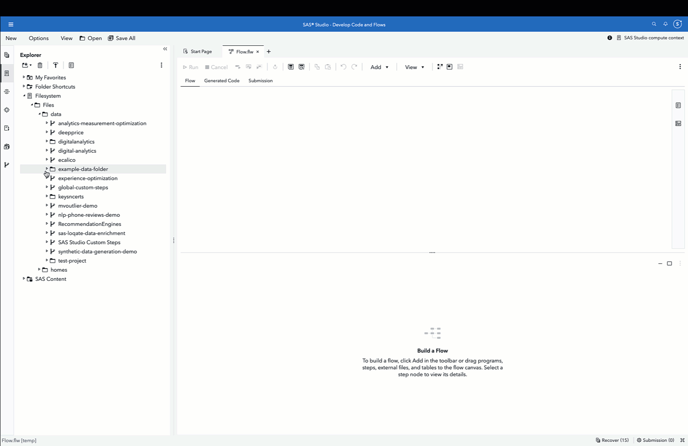

# CAS - Load Tables from Folders in Filesystem

## Description
The "[CAS - Load Tables from Folders in Filesystem](./CAS%20-%20Load%20Tables%20from%20Folders%20in%20Filesystem.step)" custom step loads all files (of a specified pattern) located within a filesystem folder, directly to in-memory Cloud Analytics Services (CAS) tables without pulling data through SAS Compute. Every file within the folder is loaded to a separate table with the same name (without the suffix).

**This custom step is useful for applications where the user wishes to load multiple files to CAS in one go.**  

For example, suppose you use source code and data located within a Git repository.  After cloning the repo using [Git Integration]((https://go.documentation.sas.com/doc/en/webeditorcdc/default/webeditorug/p0puc7muifjjycn1uemlm9lj1jkt.htm)), you can then run this step to load all required data to CAS tables.

**Here's a general idea:**

## SAS Viya Version Support
Tested in Viya 4, Stable 2022.11

## User Interface

<mark>Note that this Custom Step is intended to output Cloud Analytics Services (CAS) tables. Ensure you have a connection to CAS established before running this step. References to output table names and locations below should be interpreted as referring to CAS Tables and caslibs. </mark>

### Parameters - screenshot

### Input Arguments

#### Source File Specifications:
1. **Folder containing Input Data:** Select the folder containing your input data on the Filesystem. Note that if your folder path is already assigned to a caslib, the same caslib will be used as the input caslib from which to load data.  Files which have already been loaded to CAS may get reloaded.  Proceed with the step only if this is what you desire, otherwise simply execute a loadTable action referring to the Caslib.
2. **File extension:** As an option, you may choose to filter on a specific file extension.  A future enhancement will allow you to select multiple extensions.  For now, select either one extension, or ALL.
    - Note that when there are files of the same name but with different extensions within a directory, the CAS loadTable action follows an order in which it will try to load these files (sashdats are processed before sas7bdats before csvs, for example) and will overwrite CAS tables of the same name.  A future update will address this issue.  For now, you may like to check your folder contents beforehand and address cases of duplicate file names prior to running this step.
3. **Pattern:** As another option, you may like to provide a wildcard pattern which only loads files whose names conform to the said pattern. Feel free to leave this blank if desired. **You do not need to provide the % within the pattern.**

#### Target Specifications:
1. **Output Caslib:** Provide an output CASLIB name (PUBLIC is the default). It is necessary to provide a **global caslib** if you wish to promote your table as well.
2. **Promote Output Tables:** The default behaviour is to promote the CAS table upon load.  Uncheck this box if you wish to use this table only within a SAS Studio session.

### Output Tables
<mark>Ensure you have write access to the caslib you wish to save output tables to.  Also, when writing output tables to commonly used / shared caslibs (such as PUBLIC), be mindful that the output will change for all users of that caslib and table.</mark>

The number of output datasets may vary, depending on the number of files you have in your selected folder. You may choose to select these output tables for visualization using SAS Visual Analytics. 

### Validation
To check the status of the load, you may either refer to the Libraries tab in SAS Studio (left menu bar) or you may like to check using Manage Data / Prepare Data in the main menu.  

Refer the "About" tab on the step for further details.

## Documentation
Here's SAS documentation for the two main actions used within this Custom Step.
1. [table.fileInfo action](https://documentation.sas.com/?cdcId=sasstudiocdc&cdcVersion=default&activeCdc=pgmsascdc&docsetId=caspg&docsetTarget=cas-table-fileinfo.htm)
2. [table.loadTable action](https://documentation.sas.com/?cdcId=sasstudiocdc&cdcVersion=default&activeCdc=pgmsascdc&docsetId=caspg&docsetTarget=cas-table-loadtable.htm)
3. [Wildcard patterns within the table.fileInfo action](https://go.documentation.sas.com/doc/en/sasstudiocdc/default/pgmsascdc/caspg/p1xt9526uq5etwn1vmnk8koh0k6y.htm#n0y2zj2e81x5y5n1onqq4tibcn5h)

## Requirements

1. A SAS Viya 4 environment (monthly release 2022.07 or later) with SAS Studio Flows.

## Installation & Usage

1. Refer to the [steps listed here](https://github.com/sassoftware/sas-studio-custom-steps#getting-started---making-a-custom-step-from-this-repository-available-in-sas-studio).

## Change Log

Version 1.1 (21DEC2022)

