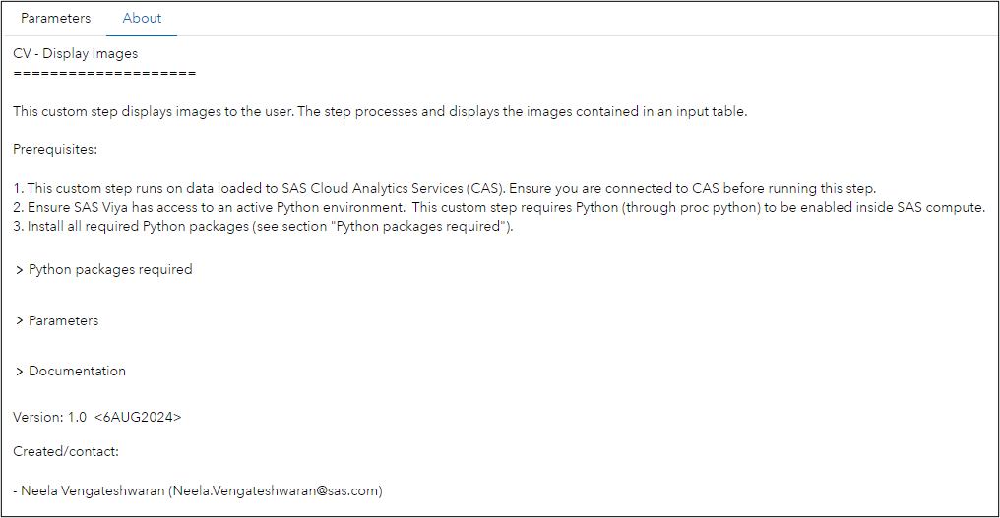
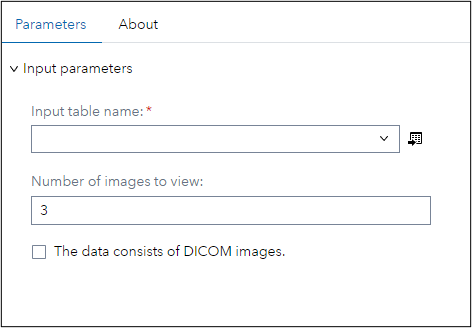

# CV - Display Images

## Description
This custom step displays images to the user. The step processes an input image table and displays the images contained in the input table. 

## User Interface
#### About Tab:

#### Parameters Tab:

## SAS Viya Version Support

Tested on Viya 4, Stable 2024.01

## Requirements

#### Ensure:

- You are connected to CAS before running this step. This custom step runs on data loaded to SAS Cloud Analytics Services (CAS).

- SAS Viya has access to an active Python environment.  This custom step requires Python (through proc python) to be enabled inside SAS compute.

- Required Python packages (see section "Python packages") are installed.

### Python packages required

- swat (1.13.3)
- python-DLPy (1.2.1-dev - NOTE: This is a dev version and cannot be directly pip installed. Instead, to access this version, use the command "pip install git+https://github. com/sassoftware/python-dlpy.git")
- matplotlib

Refer documentation link below for package details. 

### Parameters

#### Input:
1. Input table name (Required): Select/attach an input table node to this custom step. Provide a valid table name and caslib name of the CAS table containing images which the user would like to view. 

2.  Number of images to view (Optional): Provide an input value for the number of images to be displayed to the user. By default, the value is set to 3. 

3. The data consists of DICOM images (Optional): Choose whether the data contains 3-Dimensional medical DICOM images. By default, the option is set to No. 

## Documentation:
1. Documentation on the swat package: https://sassoftware.github.io/python-swat/

2. Documentation on python-dlpy package:
https://github.com/sassoftware/python-dlpy

3. Documentation on SAS callback object and methods:  https://go.documentation.sas.com/doc/da/pgmsascdc/default/proc/p0z7ahqmabxu6kn193kdojjhc477.htm

4. This SAS Communities article provides details on the environment variables which facilitate connecting to CAS using the swat package within SAS Studio: https://communities.sas.com/t5/SAS-Communities-Library/Hotwire-your-SWAT-inside-SAS-Studio/ta-p/835956

5. Peter Styliadis provides this helpful post (SAS documentation link contained therein) on how to identify a current active CAS session: https://communities.sas.com/t5/SAS-Viya/Programmatically-detect-an-active-CAS-session/m-p/890914#M1985

## Created / contact:

- Neela Vengateshwaran (Neela.Vengateshwaran@sas.com)

## Change Log
- Version 1.0 (06AUG2024)
    - Initial version
