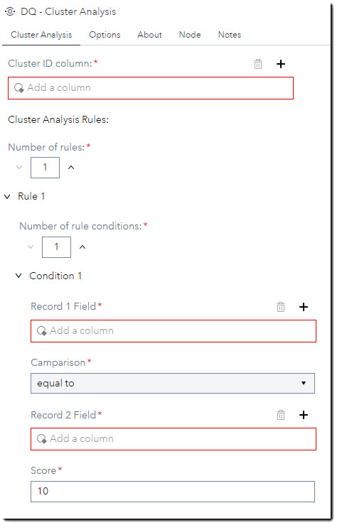

# DQ - Cluster Analysis #

## Description ##
The Cluster Analysis step enables you can compare pairs of rows within a single match cluster to determine whether each pair is really a match. This step helps you to score each record in a cluster to determine if a record in a cluster is a potential false positive or not.

* You can either run rules and set an individual score for each rule condition or
* You can use the rules to determine if a cluster rule was triggered for a record to match a cluster.

## User interface ##

### Cluster Analysis tab ###
   | Standalone mode | Flow mode |
   | --- | --- |                  
   |  |  |
1. **Cluster ID column** - Set the cluster id for the cluster to analyse.
2. **Number of rules** - Set to the number of rules for the cluster analysis. Max number of rules is 5.
3. **Number of rule conditions** - Set to the number of condition for the rule. Max number of conditions is 8.
4. **Record 1 Field** - Set the column of the first record to compare.
5. **Record 2 Field** - Set the column of the second record to compare.
6. **Camparison** - Chose from the drop down list how to compare the two record fields.
7. **Score** - Set the score to be assigned if the condition is true. Default score is 10. (*The score field is olny available for option "Use rules for cluster analysis"*)

### Options tab - Use rules for cluster analysis ###
   | Use rules for cluster analysis |
   | --- |                  
   |  |
  
   When using **Use rules for cluster analysis** the rules are used to analyse the clusters. Each record in a cluster will be compared with each other based on the rules.
   A sore will be set for each rule condition that is true.
   - **Record ID column** - If you assign a column with the unique record id, the column row1 and row2 will show the record ids which were compared. If no record id is set, the output will show the record numbers in columns row1 and row1.
   - **Show condition score** - A score column for each rule condition will be added to the output table.
   - **Show rule score** - A score column for each rule will be added to the output table. The rule sore is the aggregated condition score for rule.
   - **Show total score** - A total score column will be added to the output table. The total score is the the aggregated rule score.

> [!NOTE]
> The step is going to build a cartesian product for each cluster. All records in a cluster will be compared with each other. If clusters are big the cartesian product will be big and may result in a long run time.  
  

  
<b>Use rules for cluster analysis</b> - output

     
   | Use rules for cluster analysis - output columns |
   | --- |                  
   |  |

   - Columns **row1 & row2** indicate the record id for the records that were compared.
   - Column **R1Score** shows the score for rule 1. The is the aggregated score for the rule 1 conditions.
   - Columns **R1C1 & R1C2** show the score for the two conditions of rule 1.
   - Column **total_score** show the aggregated score for rule 1 and rule 2.

   + Row 4 shows for columns row1 & row2 the same record id and for all score columns the value -1. The value -1 indicates that this record was already compared with all other records in the cluster. For the completeness of the cluster this record has still to be shown.
   

---   
### Options tab - Use rules as cluster rules ###
   | Use rules as cluster rules |
   | --- |                  
   |  |

   When using **Use rules as cluster rules** the rules are assumed to be the rules used to cluster the data when running the cluster step. The rules should be the same rules, with the same condition and in the same order. This way the output result can be better associated with the cluster step rules.
   
  

  
<b>Use rules as cluster rules</b> - output

     
   | Use rules as cluster rules - output columns |
   | --- |                  
   |  |

   There is a column for each rule added to the output. ,br>
   E.g. if you have three rules you will see columns **R1, R2, R3** for the three rules respectively.  
   The columns indicate for each record if a cluster rule was triggered **(1)** or not **(0)**.  
   In the screenshot above for record 1 (ID 4) all cluster rules were triggered for the record to join cluster 1 (CID 1). For record 4 (ID 8074) only rule three got triggered to join cluster 2 (CID 2).  
   When analysing clusters, one can assmue the more rules were triggered for a record to join a cluster the more confident one can be in the match result.
   

   
---
## Requirements ##
2023.10 or later

## Usage ##
### Use rules for cluster analysis
   

### Use rules as cluster rules
   

## Change Log  
Version 1.0 (02FEB2024)
 * Initial version 
