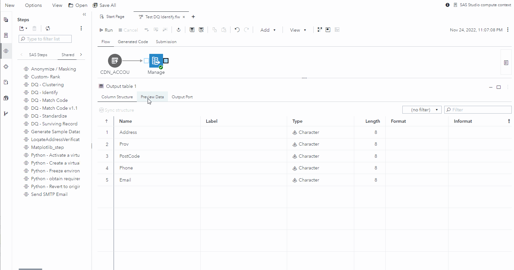

# DQ - Identify

## Description

The **DQ - Identify** step allows you to obtain the Identity Type for each individual row in a column of data based on a locale and an Identification Analysis definition using the **dqIdentify** function.  This version supports seven locales (ENCAN, ENUSA, FRCAN, FRFRA, DEDEU, ITITA and ESESP) and allows you to do Identification Analysis on up to 5 columns. 

## User Interface  

* ### Identification Analysis Options tab ###

   | Standalone mode | Flow mode |
   | --- | --- |                  
   |  |  |
   
   * This applies to Identification Analysis 1 … Identification Analysis 5

1. **Select Column**            - Defines the column on which to perform Identification Analysis.  
2. **Identification Results**   - Specify name of output column to contain generated Identity Types. If left empty, a new column will be created using name of input column suffixed with **_ID**.      
3. **Locale**                   - Pick the Locale to be used for Identification Analysis.  If left empty, the **English - USA** Locale will be used. 
4. **Definition**               - Pick the Definition to be used for Identification Analysis. If left empty, the **Field Content (Global)** Definition will be used.  

## Requirements

2021.1.1 or later  

* This custom step requires a SAS Quality Knowledge Base (QKB) to be installed and configured. More details can be found in the documentation that is available [here](https://support.sas.com/en/software/quality-knowledge-base-support.html)  

## Usage

  

## Change Log

Version 1.0 (24NOV2022)  

  * Initial version  
  

