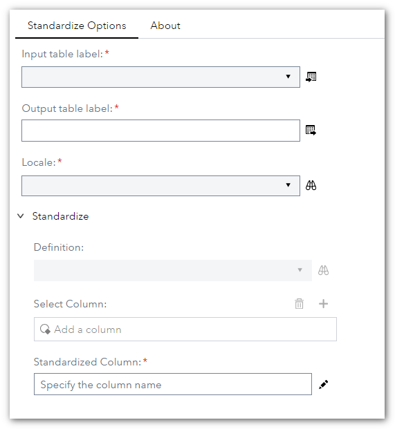
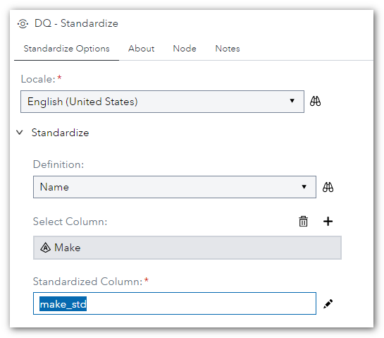
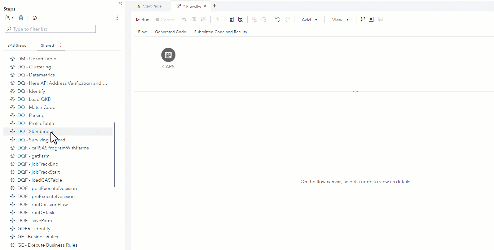

# DQ - Standardize

## Description

The **DQ - Standardize** step allows you to create a column with standardized values based on a locale and standardization definition using the **dqStandardize** function.
 * Best practice is to write the output to a new column, but you can overwrite an existing column as well.
 * If both the input table and the output table are in CAS then the step will run in CAS, otherwise it will run in the SAS Compute Server.
 * This version uses SASDQREF tables and it is possible to standardize up to 10 columns. 
 * Prompts take advantage of dynamic prompt lists (SASDQREF) and hierarchies 
 * It's worthwhile to note that the DQ Standardize step also allows you to mask data when using the data masking standardization definitions that have become available since [SAS Quality Knowledge Base for Contact Information](https://support.sas.com/en/software/quality-knowledge-base-support.html#documentation)   

## User Interface  

* ### Standardize Options tab ###

   | Standalone mode | Flow mode |
   | --- | --- |                  
   |  |  |

1. **Select column** - Defines column to be standardized.  
2. **Standardized column** - Specify name of output column to contain standardized value.  If left empty, a new column will be created using name of input column suffixed with **_STD**.  
3. **Locale**          - Define Locale to be used to compute standardized column.  
4. **Definition**      - Define the Standardization Definition to be used to compute standardized column.  

## Requirements  

2023.06 or later  

* This custom step requires a SAS Quality Knowledge Base (QKB) to be installed and configured. More details can be found in the documentation that is available [here](https://support.sas.com/en/software/quality-knowledge-base-support.html)  

## Usage  

## Change Log  
  
Version 2.1 (27JUL2023)
 * assign SASDQREF if it has not been assigned 
    * Note: Only needed when generated SAS code contains references to this libref, so libref exists during background submit and scheduled jobs. Not needed otherwise. So not needed by this step per se, but added anyway.  
  
Version 2.0 (20JUL2023)
 * use of the SASDQREF library to extend support to all locales defined in the QKB.
 * use of hierarchical prompts and dynamic lists.
  
Version 1.1 (05DEC2022)
 * adds support for Canadian locales.  (ENCAN, FRCAN)
 * avoids warning by skipping length declaration for the output field if over-writing the input field.
 * adds documentation in the About tab how to get the step to run in CAS
 * improves text in the controls to meet UI standards

Version 1.0 (14SEP2022)
 * Initial version 