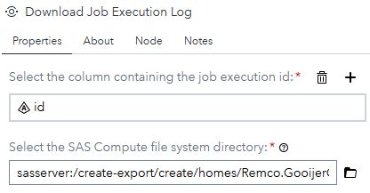
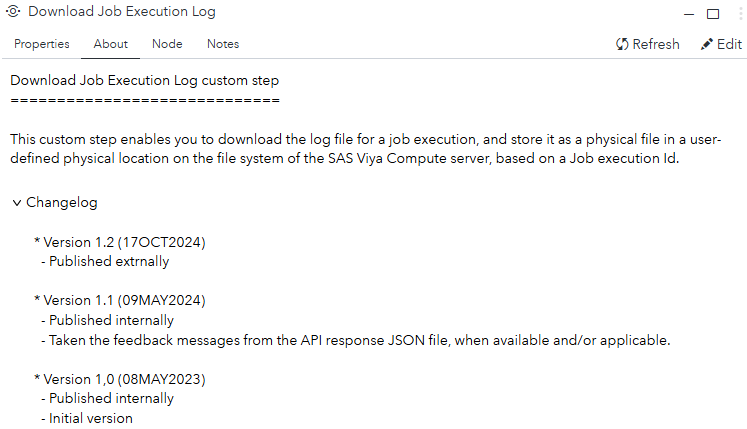
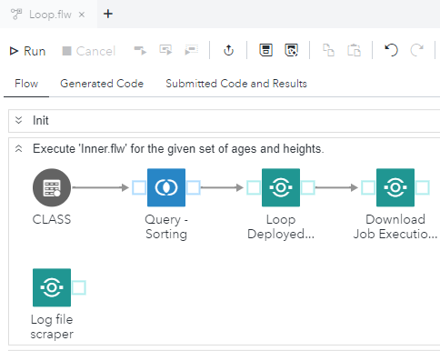

# Download Job Execution Log

## Description

This custom step enables you to download the log file for a job execution and store it as a physical file in a user defined physical location, based on a Job execution Id. 

## SAS Viya Version Support

Created and tested on Viya 4, Stable 2023.01 and Stable 2024.08

## Typical usage

When running processes as a job or job flow, you can download the logs manually from the SAS Viya Environment Manager.  

With this custom step you can do that in an automated manner from within a flow or job, ready for further processing and/or reviewing.

## User Interface

### Tab: Properties

Here you can set the following parameters:

- **Job execution id**: This is the column in the input table that contains the job execution id for which you want to download the log file.
- **Physical target directory**: The physical location where the log files will be saved to.

### Tab: About

## Usage

Download the .step file, upload it into your environment and start using it, for example, as shown:

The [Loop Deployed Object](../Loop%20Deployed%20Object/README.md) custom step outputs a table that contains a job execution id. That table can be used as input for this custom step, in order to review/scrape the physical, downloaded, log files.

## Input port

The input table needs to provide a column that contains the job execution id for which you want to download the log file for.

## Output port

The output table for this custom step contains the following three columns:

- **JobExecutionId**: Contains, as the name implies, the job execution id for which the custom step tried to download the log file.
- **logFile**: Contains the physical location and name of the log file for the given job execution id.
- **message**: In case there something wrong in the process of retrieving the log file for the given job execution id, you will find it here.

## Notes

- The naming convention for the log file is: \<**job name**>\_\<**account name**>\_\<**start date/time**>.log, which is the same as for the environment manager.
- The physical files can be found, after running this custom step, in the specified physical location:

- 
- The process is a two step rocket. The first step is getting generic information together with the URI of the log entity. The second step is to retrieve the actual log file and writing it to the specified location with the specified name.
- Not all job executions are the same. Some of them do not have a log file associated to them. In case that happens, you will see the message in the resulting output table:  **ERROR: The column 'logLocation' doesn not exist, in the initial response file. Unable to retrieve the log file.**
- In case you don't have permission to see/download the log file, you will see the following message in the resulting output table: **File could not be read. User does not have permission.**
- When a Job execution, for the given Id, can't be found you will see the following message in the resulting output table: **Job not found with id: eeabf86b-e2dc-4ed0-935a-2e0a29a65285.**
- Each message from this custom step is pre-fixed with **'ERROR:'**. Every other message is comming from the Viya environment itself.

## Change Log

 * Version 1.2 (17OCT2024)
   * Published externally.

 * Version 1.1 (09MAY2023)
   * Taken the feedback messages from the JSON file, when available and/or applicable.

 * Version 1 (08MAY2023)
   * Initial version.