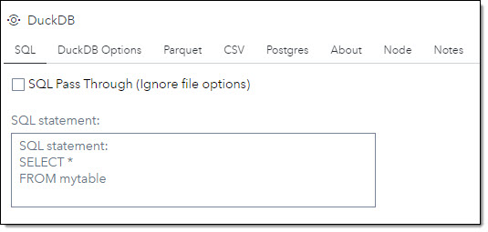
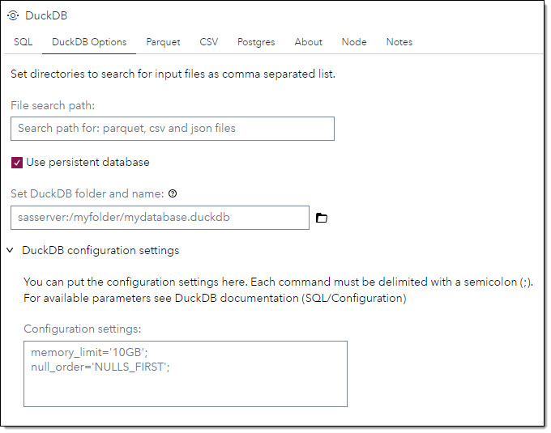
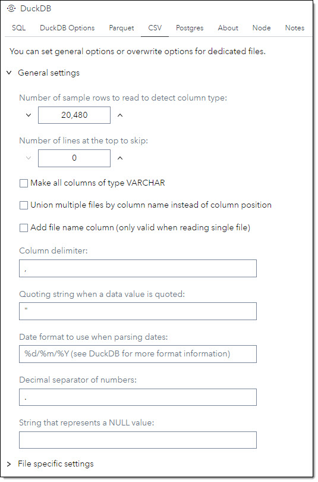
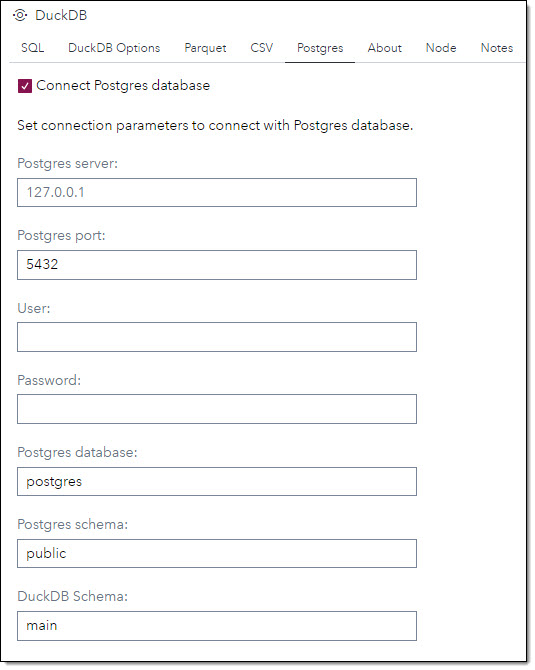

# DuckDB
### Contents
1. [Description](#description-)
2. [User Interface](#user-interface-)
3. [Requirements](#requirements-)
4. [Usage](#usage-)

## Description <a name="description-"></a>

The **DuckDB** step enables you to use [DuckDB](https://duckdb.org), a column-oriented in-process SQL OLAP database management system, to access data.
In this version the following data sources are supported:
-	[Parquet](#parquet-tab-)
-	[CSV files](#csv-tab-)
-	[Postgres](#postgres-tab-)

---

- You can use the step either as a start step or in the middle of a flow. When used in the middle of a flow, you can reference the input table in a SQL statement as *_flow_table*.<br>For example: `SELECT * FROM _flow_table`
- You can build SQL statements referencing tables from different data stores like Parquet, CSV, etc. <br>For example: `SELECT * FROM taxi.parquet t JOIN driver.csv d ON t.driver_id = d.driver_number`

<p align="center">
   
</p>

For documentation on supported SQL see [DuckDB SQL documentation](https://duckdb.org/docs/sql/introduction).

---

## User Interface <a name="user-interface-"></a>
There are 5 tab on the user interface for the custom step:
1. [SQL tab](#sql-tab-)
2. [DuckDb Optios tab](#duckdb-options-tab-)
3. [Parquet Optios tab](#parquet-tab-)
4. [CSV tab](#csv-tab-)
5. [Postgres tab](#postgres-tab-)

---

* ### SQL tab <a name="sql-tab-"></a>
In the tab SQL you can submit one or more SQL statements.
   | Standalone mode | Flow mode |
   | --- | --- |                  
   |  |  |
   
   | UI Field | Comment |
   | --- | --- |
   | Ignore file options | When ticked:<br> - All options set in tab *Parquet* and *CSV* will be ignored.<br> - SQL will be sent *as is* to DuckDB.<br> - You can use SQL with DuckDB functions. E.g.:<br>```SELECT * FROM read_parquet('test.parq');``` |
   | SQL statement | Field for SQL statement.<br>For allowed SQL syntax see [DuckDB SQL documentation](https://duckdb.org/docs/sql/introduction)<br>You can submit several SQL statements in this field.<br>SQL statements need to delimited with a semicolon (;) when submitting more than one statement.<br>Example - Load table into DuckDB:<br>`CREATE SCHEMA IF NOT EXISTS asd;`<br>`CREATE TABLE taxi as (`<br>`SELECT * FROM mytaxidata.csv);`|

---

* ### DuckDb Optios tab <a name="duckdb-options-tab-"></a>
This tab is to set general options for DuckDB.
   | DuckDB Options |
   | --- |
   |  |

| UI Filed | Comment | 
|--|--|
| File search path | Set all paths as comma separated list where DuckDb can find *Parquet* or *CSV* files  |
| Use persistent database | When ticked you can set a persistent database for DuckDB |
|Set DuckDB folder and name | Set the folder and name for the database. The database has to reside on SAS Server. The database cannot reside in SAS Content. |
| Configuration settings | Set DuckDB configuration settings. Each command must be delimited with a semicolon (;). For available parameters see [DuckDB documentation](https://duckdb.org/docs/sql/configuration)

---

* ### Parquet tab <a name="parquet-tab-"></a>
This tab is to set parameters for reading Parquet files. The options in this tab will only take effect on selecting data from one Parquet file. The options will not take effect when joining tables.

   | Parquet files |
   | --- |
   |  |

| UI Filed | Comment | DuckDB Parameter |
|--|--|--|
| Add row number column | A column containing the row number will be added to the output table. | file_row_number |
| Add file name column | A column containing the the Parquet file name will be added to the output table. | filename |
| Union multiple files by column name instead of column position | You can read several files with the same file structure in one SQL statement. E.g.: SELECT * FROM yellow*.parquet. If this option is ticked DuckDB will union the files by column name. If the option is *not* ticked DuckDb will union the files by column position. | union_by_name |

---

* ### CSV tab <a name="parquet-tab-"></a>
This tab is to set parameters for reading csv files. You can set *General settings* valid for all csv files or you can overwrite settings for  up to 5 names files.

   | CSV - General settings | CSV - File settings |
   | --- | --- |
   |  | |

#### General settings
| UI Filed | Comment | DuckDB Parameter |
|--|--|--|
| Number of sample rows to read to detect column type | Number of sample rows to be read to detect column type. | sample_size |
| Number of lines at the top to skip | Number of rows from the top not to be read. | skip |
| Make all columns of type VARCHAR | Makes all columns in the file of type varchar even if they only hold numeric values. | all_varchar |
| Union multiple files by column name instead of column position | You can read several files with the same file structure in one SQL statement. E.g.: SELECT * FROM yellow*.csv. If this option is ticked DuckDB will union the files by column name. If the option is *not* ticked DuckDb will union the files by column position. | union_by_name |
| Add file name column | A column containing the the csv file name will be added to the output table. The option only take effect on selecting data from a single file. The options will not take effect when joining tables. | filename |
| Column delimiter | Delimiter to separate columns in the csv file. | delim |
| Quoting string when a data value is quoted | Specify the quoting string to be used when a data value is quoted. Default is double quotes. | quote |
| Date format to use when parsing dates | Specify the date format to use when parsing dates. E.g. use %d/%m/%Y to show the date like 15/05/2023. For more format information see [DuckDB documentation](https://duckdb.org/docs/sql/functions/dateformat) | dateformat |
| Decimal separator of numbers | Set decimal separator of numbers. Default is dot (.) | decimal_separator |
| String that represents a NULL value | Specify a string that represents a NULL value | nullstr |

| UI Field | Comment  |
|--|--|
| Number of csv files to overwrite general options | Set the number of named file to overwrite general options. You can set up to 5 overwrite settings. |

### File overwrite settings
In *Overwrite settings* you have the same settings as in the *General settings* section plus some file specific settings. If an overwrite setting for a file is set, all settings for the named files will be picked up from the appropriate overwrite section.
In the table below only the file specific settings are listed:
| UI Filed | Comment | DuckDB Parameter |
|--|--|--|
| File name | The name of the csv file to overwrite the *general settings* for. The file name is case sensitive and must include the file suffix '.csv' ||
| Column names | Set or overwrite the file column names. The column names are supplied as a string comma separated list. E.g.: 'A1','B2','C3' will set the column names for columns 1 - 3 in the respective order.| names |
| Column names and types | Set or overwrite the column names and types. The format is: 'column name':'column type' as a comma separated list. E.g.: 'Col1':'INTEGER','Col2':'VARCHAR'. For a list of available data types see [DuckDB documentation](https://duckdb.org/docs/sql/data_types/overview) | columns |

* ### Postgres tab <a name="postgres-tab-"></a>
This tab is to set connection parameters for PostgreSQL. 
When connected with Postgres, DuckDb will create views for all tables in the Postgres schema. No data is uploaded into DuckDB. DuckDb is using its *Postgres Scanner* to receive data from Postgres.

> **Tip**: Depending on data access frequency, data size and the required performance it may be worth uploading data into DuckDB to
> gain better performance.

   | PostgreSQL |
   | --- |
   |  |

| UI Filed | Comment |
|--|--|
| Connect Postgres database | When ticked a connection to Postgres will be established using the below connection settings |
| Postgres server | Numeric IP address or name of host to connect to. |
| Postgres port | Port number to connect to at the server host. |
| User | PostgreSQL user name to connect as. |
| Password | Password to be used. |
| Postgres database | The Postgres database name to connect to. |
| Postgres schema | The Postgres database schema to connect to. |
| DuckDB Schema | The database schema in DuckDB where the views for the Postgres tables are written to. If the schema name does not exist it will be created.

## Requirements <a name="requirements-"></a>
2023.01 or later  
* Python needs to be installed and configured to work with SAS Studio.
* The Python package for DuckDB to be installed `pip install duckdb`

## Usage <a name="usage-"></a>
When you have installed the custom step, test it to ensure it is working with your Python DuckDB.
* Right mouse click on the step.
* Choose "Open in a tab".
* Set output table to WORK.duckout
* Set SQL statement ```SELECT 42```.
* Run step.
<p align="center">
   
</p>

If DuckDB is not installed or Python cannot find it you will receive an error: "Unhandled Python exception. No module named 'duckdb'" 
<p align="center">
   
</p>

For examples using the DuckDB step in SAS Flow see [here](extras/README.md)

## Change Log  
Version 1.0 (15MAR2023)
 * Initial version 

