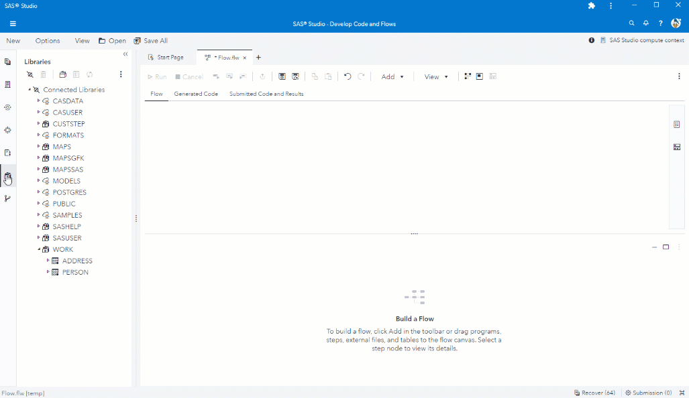

# Usage Examples

Here are two examples, including test data, how to use the custom step.

---

## Example 1: Save flow data to parquet file.

In this example we write the flow input data "ADDRESS" to a Parquet file on the server.

---

## Example 2: Join flow data with data from parquet file.

In this example we join the flow input data PERSON with the Parquet data ADDRESS that we have written in example 1.

---

## Example 3: Pass DuckDB data from one DuckDB step to the next.

By default DuckDB will only write its data into memory and at the end of the custom step the data that was written into memory will get lost. However, you can write data to a DuckDB database file. For the custom step you have to do this if you want to pass DuckDB data (data that you have written to DuckDB) from one DuckDB custom step to the next.

