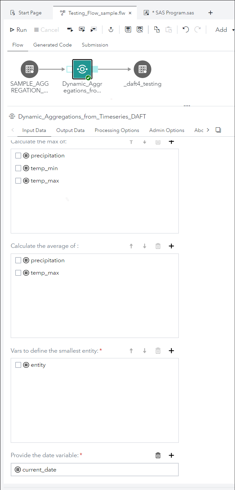
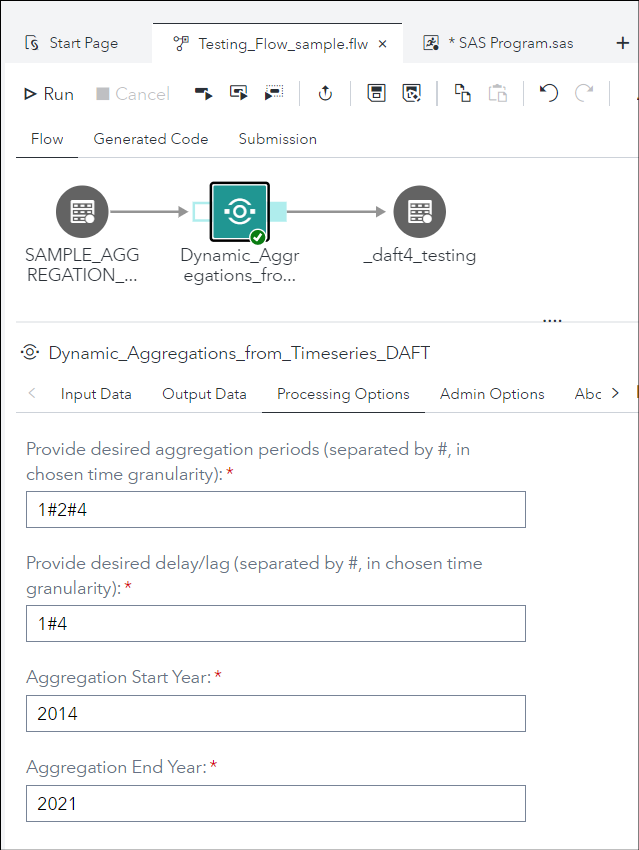
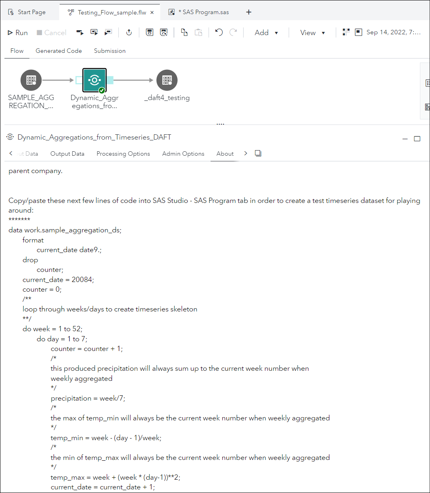

[[_TOC_]]

# Dynamic Aggregations From Timeseries DAFT

* [Description](#description)
* [SAS Viya Version Support](#sas-viya-version-support)
* [User Interface](#user-interface)
* [Requirements](#requirements)
* [Usage](#usage)

## Description

The "**Dynamic Aggregations From Timeseries DAFT**" Custom Step enables SAS Studio Flow users to easily perform dynamic aggregations on timeseries data by the push of a button.

What does dynamic exactly means?
Let's explain based on an example: often times the outcome of events is dependent on other events that happened in the past. So it is important to get the view on the data how something looked like e.g. 4 weeks ago/7 weeks, etc... ago. And how does it look like back then when looking at the aggregate data of 2 weeks/3 weeks, etc...

Also, often times it is not known which time parameters are important to look at, hence it might be important to create a whole bunch of combinations and then let the statistic decide which combination is important. 

DAFT allows to calculate an unlimited amount of combinations if necessary.

At this point, DAFT allows the following aggregation functions:
- sum 
- mean
- min 
- max

The aggregations are based on one of the following time units:
- day 
- week
- month
- quarter

With time series data usually being very granular, aggregating to higher level is necessary to allow best results for analytic purposes. 
Usually it depends on the problem which granularity to choose. 

The output dataset is then made available based on that chosen granularity. 

Example:
Weather data is available on a minute basis, and the problem at hand requires to look at the data on a weekly basis and it is required to look at the summed up precipitation over 1 week and 2 weeks for both 4 weeks and 8 weeks ago. 

The aggregation sequence that needs to be provided is: 1#2
The lag sequence that needs to be provided is: 4#8

DAFT then creates all combinations between aggregation and lag sequence and the output variables would look like:
- precipitation_sum1L4
- precipitation_sum1L8
- precipitation_sum2L4
- precipitation_sum2L8

with "sum" describing the statistic that is being looked at for that variable, and the number behind it describes the length based on the selected unit, and "L" describing which lag is being looked. 

Since the granularity is "By Week", DAFT would create the following 2 time variables:
_DAFT_year
_DAFT_week

Additionally the output dataset contains the variables that describe the entity. 
In the weather example, this could the region/county level, or zip code level, etc...
In other examples, e.g. when the transaction data is e.g. bank data, the smallest entity could be person, household, company or parent company.

## SAS Viya Version Support
tested on 2022.1.2, but should work in earlier releases as well

## User Interface

### Input Data Tab

The complete options are spread over 2 screenshots:





### Output Data Tab


### Processing Options Tab



### Admin Options Tab


### About Tab




## Requirements

* A CAS session established (in an autoexec or something else)


## Usage

### How to Run DAFT with Default Settings


Copy/paste these next few lines of code into SAS Studio - SAS Program tab in order to create a test timeseries dataset for playing around:
*******
```sas
data work.sample_aggregation_ds;
	format 
		current_date date9.;
	drop
		counter;
	current_date = 20084;
	counter = 0;
	/**
	loop through weeks/days to create timeseries skeleton
	**/
	do week = 1 to 52;
		do day = 1 to 7;
			counter = counter + 1;
			/* 
			this produced precipitation will always sum up to the current week number when 
			weekly aggregated
			*/
			precipitation = week/7;
			/*
			the max of temp_min will always be the current week number when weekly aggregated
			*/
			temp_min = week - (day - 1)/week;
			/*
			the min of temp_max will always be the current week number when weekly aggregated
			*/
			temp_max = week + (week * (day-1))**2;
			current_date = current_date + 1;
			/*
			create random entity number between 0 and 1, also create an entity number 2, for which 
			above rules apply for summation expectation
			*/
			entity = floor(mod(ranuni(counter)*100,2));
			cal_week = week(current_date);
			output;
			entity = 2;
			output;
		end;
	end;
run;

```
**************

## Change Log

Version 2.0.1 (14SEP2022)

initial published version as a custom step
