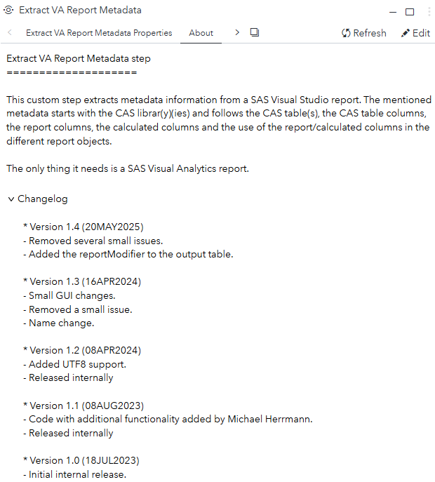
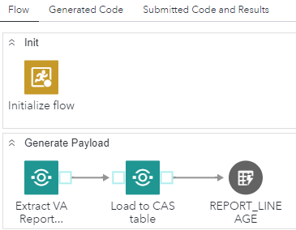

# Extract VA Report Metadata

## Description

This custom step extracts matadata information from a SAS Visual Analytics report. The mentioned metadata starts with the CAS librar(y)(ies) and follows the CAS table(s), the CAS table columns, the report columns, the calculated columns and the use of the report/calculated columns in the different report objects.

## SAS Viya Support

Created and tested on Viya 4, Stable 2023.05

## Potential issue

When the JSON format for a SAS VA report changes, it might be possible that this custom step needs to be updated.

## Typical usage

This custom step generates the metadata for 1 report. The output can be stored in your data warehouse and/or be stored directly in CAS to create a report on.

Note that this custom step is able to run under the control of the [Loop Deployed Object](../Loop%20Deployed%20Object/README.md) custom step to generate the report lineage for more than one report at a time.

# User Interface

## Tab: Extract VA Report Metadata Properties

- **Select report**: Here you can select the report for which you want to generate the metadata.

Note that: 
- Make sure that, in case of using the [Loop Deployed Object](../Loop%20Deployed%20Object/README.md) custom step, the macro variable as specified in the flow that contains the [Loop Deployed Object](../Loop%20Deployed%20Object/README.md) custom step, needs to be used as shown below, where you can ignore the red cross. After that you can deploy the flow as a job to make it available to the [Loop Deployed Object](../Loop%20Deployed%20Object/README.md) custom step.
- The macro variable, 'reportPath', is just an example.

## Tab: About

## Usage

Download the .step file, upload it into your environment and start using it, for example, as shown:

In this simple example, the output of the Extract VA Report Metadata custom step is directly append, by the 'Load to CAS' custom step, into a CAS table to build a report on.

Note that the flow shown can be used by the [Loop Deployed Object](../Loop%20Deployed%20Object/README.md) custom step.

## Output port

The custom step has one output table with the following information:

## Change Log

* Version 1.3 (16APR2024)
    * Small GUI changes.
    * Removed a small issue and did a name change.
* Version 1.2 (08APR2024)
    * Added UTF8 support and first public release.
* Version 1.1 (08AUG2023)
    * Code with additional functionality, added by Michael Herrmann, has been merged and tested.
* Version 1 (18JUL2023)
    * Initial version.