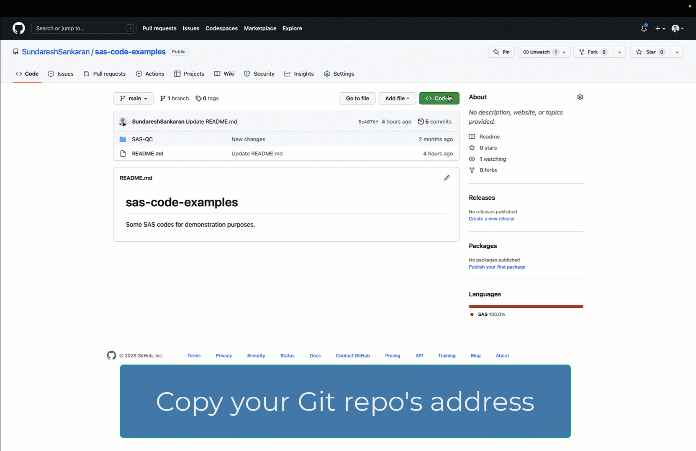

# Overview of Git-related Custom Steps

## Description

The [SAS Studio Custom Steps] repository contains custom steps prefixed with "Git - ", which help you access Git (a popular source code management and repository service) functionality from within a SAS Studio Flow.

Such capability already exists through [SAS functions](https://documentation.sas.com/?cdcId=pgmsascdc&cdcVersion=default&docsetId=lefunctionsref&docsetTarget=n10pxql65jtf4sn11m3d6jzcrgcz.htm) as well as [Git integration in SAS Studio](https://documentation.sas.com/?cdcId=webeditorcdc&cdcVersion=default&docsetId=webeditorug&docsetTarget=p0puc7muifjjycn1uemlm9lj1jkt.htm).

Providing similar functionality through these Custom Steps helps you access source code and assets from within a SAS Studio Flow (which is basically a SAS program provided through low-code components).  This enables portability and provides you Git version control, change tracking, and versatility in terms of choosing the analytics environment where you execute a set of SAS programs.   

**Here's a general idea:**

The below image is an animated GIF.

Please go through this section to note the [Requirements for all steps](#requirements). 

## List of Custom Steps (this will expand as more contributors add more steps)

1. [Git - Clone Git Repo](./README.md)
2. [Git - Delete Local Repo](../Git%20-%20Delete%20Local%20Repo/README.md)
3. [Git - List Local Repo Changes](../Git%20-%20List%20Local%20Repo%20Changes)
4. [Git - Stage, Commit, Pull and Push Changes](../Git%20-%20Stage%2C%20Commit%2C%20Pull%20and%20Push%20Changes)

## Which Git repositories are we talking about?

These Custom Steps can connect to and pull code from public and restricted access (subject to access rights) Git repositories on GitHub or GitLab. While not tested, it can also access code from a corporate Git repository (for example, gitlab.company.com) if the SAS Viya environment is within the same Virtual Private Network (VPN).

## Requirements

1. A SAS Viya 4 environment (monthly release 2022.11 or later) with SAS Studio Flows.

2. **Configure Viya environment for Git integration**: This is typically carried out by the administrator of your Viya environment. Some suggested properties are available [here](https://go.documentation.sas.com/doc/en/sasstudiocdc/v_035/webeditorcdc/webeditorag/p1a2vn20wzwkumn1freonkz81mx5.htm).

3. **SSH key registration**: Note that most Git repository hosting services (such as GitHub) require a SSH key to be registered with them and used for authentication. Ensure that you have followed instructions provided [here](https://go.documentation.sas.com/doc/en/sasstudiocdc/default/webeditorcdc/webeditorug/p0urbfmbb9lkpdn15yzavxdk1lgk.htm). [Here](https://docs.github.com/en/authentication/connecting-to-github-with-ssh/adding-a-new-ssh-key-to-your-github-account) are instructions from GitHub on adding a SSH key to your GitHub account. It is recommended to use ECDSA SSH Keys when working with GitHub.

4. **Save SSH keys in Filesystem**: Once you have your SSH keys generated, upload them to a folder within your filesystem. This is referred to within documentation [here](https://go.documentation.sas.com/doc/en/sasstudiocdc/v_035/webeditorcdc/webeditorug/p0urbfmbb9lkpdn15yzavxdk1lgk.htm).  To protect the integrity of your keys, ensure that only desired users have access to the folder where you are saving them to.

## Documentation
1. [Understanding Git Integration in SAS Studio](https://go.documentation.sas.com/doc/en/sasstudiocdc/default/webeditorcdc/webeditorug/p0puc7muifjjycn1uemlm9lj1jkt.htm)
2. [Using Git Functions in SAS](https://go.documentation.sas.com/doc/en/pgmsascdc/default/lefunctionsref/n1mlc3f9w9zh9fn13qswiq6hrta0.htm)
3. [Configuration Properties for Git Integration](https://go.documentation.sas.com/doc/en/sasstudiocdc/default/webeditorcdc/webeditorag/p1a2vn20wzwkumn1freonkz81mx5.htm)

## Change Log
Version : 1.0.   (25JAN2023)

