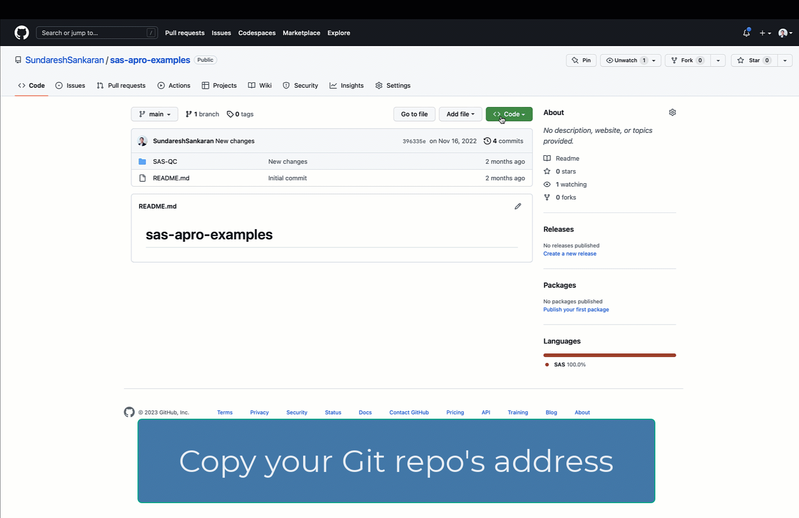
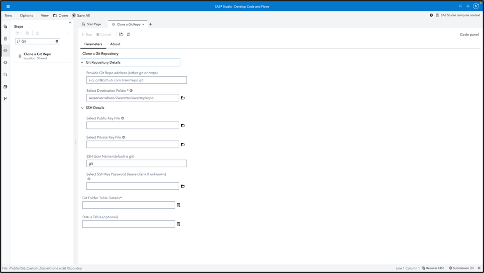

# Git - Clone a Git Repo

This custom step helps you clone a repository from a Git platform (like GitHub, Gitlab etc.) to a folder in your Filesystem.

Please refer this [page](./Overview%20of%20Git-related%20Custom%20Steps.md) which explains the motivation behind Custom Steps which surface Git integration functionality.

**Here's a general idea of how this custom step works (the below is an animated GIF)**

## SAS Viya Version Support
Tested in Viya 4, Stable 2022.11

## Which Git Repositories are we talking about?

This Custom Step can connect to and pull code from public and restricted access (subject to access rights) Git repositories on GitHub or Gitlab.com. While not tested, it can also access code from a corporate Git repository (for example, gitlab.company.com) if the SAS Viya environment is within the same Virtual Private Network (VPN).

## Requirements

1. A SAS Viya 4 environment (monthly release 2022.11 or later) with SAS Studio Flows.

2. **Configure Viya environment for Git integration**: This is typically carried out by the administrator of your Viya environment. Some suggested properties are available [here](https://go.documentation.sas.com/doc/en/sasstudiocdc/v_035/webeditorcdc/webeditorag/p1a2vn20wzwkumn1freonkz81mx5.htm).

3. **SSH Key registration**: Note that most Git repository hosting services (such as GitHub) require a SSH key to be registered with them and used for authentication. Ensure that you have followed instructions provided [here](https://go.documentation.sas.com/doc/en/sasstudiocdc/default/webeditorcdc/webeditorug/p0urbfmbb9lkpdn15yzavxdk1lgk.htm). [Here](https://docs.github.com/en/authentication/connecting-to-github-with-ssh/adding-a-new-ssh-key-to-your-github-account) are instructions from GitHub on adding a SSH key to your GitHub account. It is recommended to use ECDSA SSH Keys when working with GitHub.

4. **Save SSH Keys in Filesystem**: Once you have your SSH keys generated, upload them to a folder within your filesystem. This is referred to within documentation [here](https://go.documentation.sas.com/doc/en/sasstudiocdc/v_035/webeditorcdc/webeditorug/p0urbfmbb9lkpdn15yzavxdk1lgk.htm).  To protect the integrity of your keys, ensure that only desired users have access to the folder where you are saving them to.

## User Interface

### Parameters

#### Section - Git Repository Details

1. **Address of the Git repo you wish to clone:**  Note that it is of the format git@repo-address.git for SSH connections. A future release will also allow for providing addresses as per the Secure HTTPS connection (https://git-repo.git).
2. **Destination folder:** This is a folder on your filesystem.  Ensure this is an empty folder when cloning from a git repository.

#### Section - SSH Details

1. **Path to your public key file.**
2. **Path to your private key file.**

For #s 2 and 3 above, ensure that your key files are saved in a filesystem folder with proper access rights. These keys contain credential information and are typically saved within folders which only the user can access.

3. **SSH user name:** This is usually git. Leave the value as it is for most cases unless you are sure of the value. For example, if your SSH URL is “git@github.com:myname/myrepo.git” then the SSH user name is“git”.
4. **SSH password:** Specify the password for your SSH key. If your SSH keys are not password protected, specify empty quotation marks ("" or '').

#### Output Ports/Tables
You can optionally specify two output ports. 
1. **Git Folder Table:** Specify a table which will be used to store metadata about the git folder that has been pulled.  In this initial release, only the top level folder is provided, which can be used for downstream tasks (such as referring to a file location).  In future, we will list out all contents of the repo so that users can view the details of the files pulled.
2. **Status Table:** A simple status table to note the value of the return code after the GIT_CLONE function. The return codes are explained [here](https://go.documentation.sas.com/doc/en/pgmsascdc/default/lefunctionsref/n10pxql65jtf4sn11m3d6jzcrgcz.htm#n0ycxetz1hi8czn1jo5us0gjpdg3).

## Documentation
1. [Understanding Git Integration in SAS Studio](https://go.documentation.sas.com/doc/en/sasstudiocdc/default/webeditorcdc/webeditorug/p0puc7muifjjycn1uemlm9lj1jkt.htm)
2. [Using Git Functions in SAS](https://go.documentation.sas.com/doc/en/pgmsascdc/default/lefunctionsref/n1mlc3f9w9zh9fn13qswiq6hrta0.htm)
3. [Configuration Properties for Git Integration](https://go.documentation.sas.com/doc/en/sasstudiocdc/default/webeditorcdc/webeditorag/p1a2vn20wzwkumn1freonkz81mx5.htm)

## Installation & Usage
1. Refer to the [steps listed here](https://github.com/sassoftware/sas-studio-custom-steps#getting-started---making-a-custom-step-from-this-repository-available-in-sas-studio).

## Change Log
Version : 1.0.   (25JAN2023)

