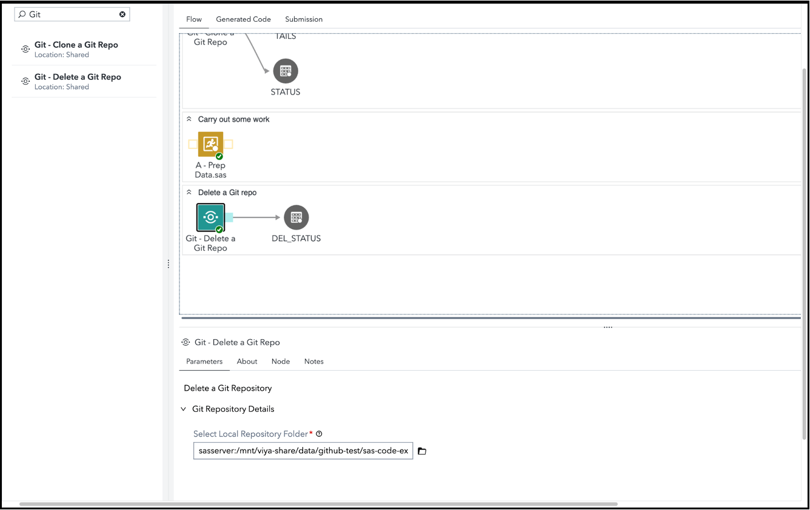

# Git - Delete Local Repo

This custom step helps you delete a local copy of a Git repository in your filesystem, which you may have cloned earlier from a Git platform (like GitHub, GitLab etc.).

Note that this affects the LOCAL copy of the Git repository, and not the content on the repository hosting service itself.

Please refer this [page](../Git%20-%20Clone%20Git%20Repo/Overview%20of%20Git-related%20Custom%20Steps.md) which explains the motivation behind Custom Steps which surface Git integration functionality.

## User Interface

### Parameters

#### Git repository details

1. Select the **local repository folder** on the filesystem where your Git content is saved.

#### Output Tables
You can optionally specify a table for the status table output port. 
1. **Status Table:**  This is a simple status table which can be used to note the value of the return code after the GIT_DELETE_REPO function.  Return Codes are explained in the Documentation (#4) below.

## Documentation
1. [Understanding Git Integration in SAS Studio](https://go.documentation.sas.com/doc/en/sasstudiocdc/default/webeditorcdc/webeditorug/p0puc7muifjjycn1uemlm9lj1jkt.htm)
2. [Using Git Functions in SAS](https://go.documentation.sas.com/doc/en/pgmsascdc/default/lefunctionsref/n1mlc3f9w9zh9fn13qswiq6hrta0.htm)
3. [Configuration Properties for Git Integration](https://go.documentation.sas.com/doc/en/sasstudiocdc/default/webeditorcdc/webeditorag/p1a2vn20wzwkumn1freonkz81mx5.htm)
4. [The GIT_DELETE_REPO Function](https://go.documentation.sas.com/doc/en/sasstudiocdc/default/pgmsascdc/lefunctionsref/n05xa2vo2wnzzon1ujsxkgduv1bh.htm#n17ri3xlx22i6en1t7ahybd09c0yc)

## Installation & Usage
1. Refer to the [steps listed here](https://github.com/sassoftware/sas-studio-custom-steps#getting-started---making-a-custom-step-from-this-repository-available-in-sas-studio).

## Change Log
Version : 1.0.   (26JAN2023)