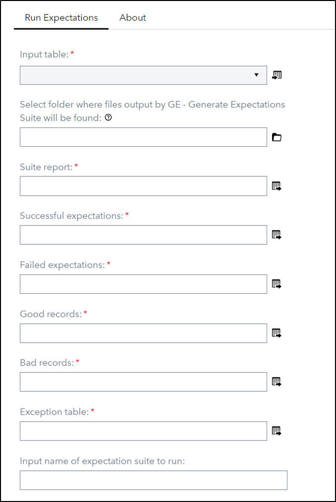
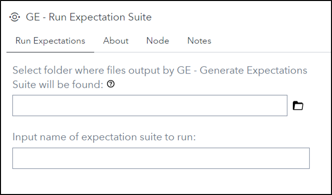
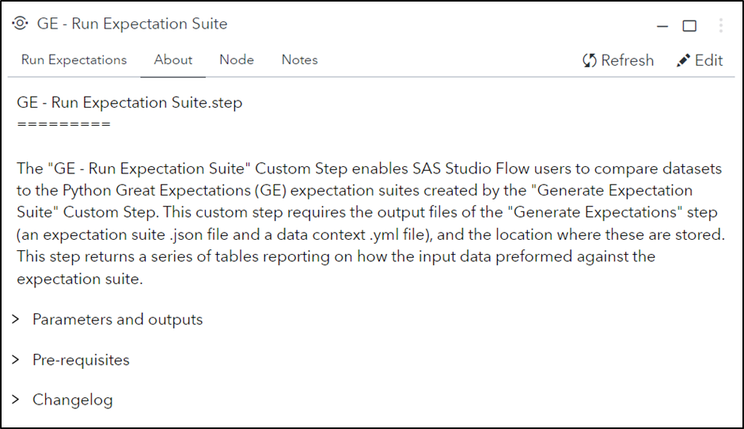
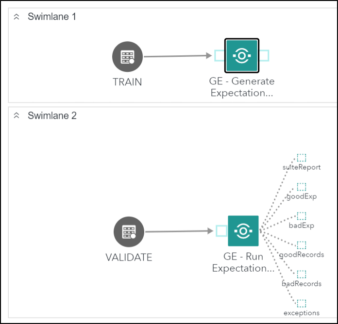

# Great Expectations - Run Expectation Suite

## Description

The **GE - Run Expectation Suite** custom step enables SAS Studio Flow users to utilize Python [Great Expectations](https://greatexpectations.io/) (GE) to compare datasets based on the expectation suites created by the **GE - Generate Expectation Suite** custom step. This custom step requires the output files of the **GE - Generate Expectation Suite** step (an expectation suite .json file and a data context .yml file), and the location where these are stored. This step returns a series of six tables reporting on how the input data preformed against the expectation suite.

## User Interface

* ### Generate Expectations tab ###

   | Standalone mode | Flow mode |
   | --- | --- |                  
   |  |  |

* ### About tab ###

   

## Requirements

Tested on Viya version Stable 2022.04.
Python's great_expectatons library version v0.16.8 or after.
The output .json expectation suite file from running **GE - Generate Expectation Suite**
The output great_expectations.yml file from running **GE - Generate Expectation Suite**
This Custom Step requires that Python be deployed and available in your SAS environment. The easiest way to achieve this is to enable and configure sas-pyconfig job which also brings along the GE package, following the steps indicated in this [article](https://communities.sas.com/t5/SAS-Communities-Library/Using-the-SAS-Configurator-for-Open-Source-to-Build-Python-and-R/ta-p/842310).
Alternatively, one can run this custom step by first pip installing Python and GE. Follow the steps below to get GE into your environment:
```
import pip
import os
os.getcwd()
pip.main(['install','great_expectations','--target=.'])
sys.path.append('./local/bin')
sys.path
```

## Usage



Use the following code to get example data sets for use with the GE - Generate Expectation Suite and GE - Run Expectation Suite custom steps.

```
/* create example data for rule generation and rule execution */
/* Example data sets will be created from sashelp.cars */

/* set values for training and validation */
%let propTrain = 0.7;         /* proportion of training data */
%let propValid = 0.3;         /* proportion of validation data */

/* create a separate data set for each role */
data Train Validate;
array p[2] _temporary_ (&propTrain, &propValid);
set Sashelp.Cars;
call streaminit(12);         /* set random number seed */
/* RAND("table") returns 1, 2, or 3 with specified probabilities */
_k = rand("Table", of p[*]);
if      _k = 1 then output Train;
else if _k = 2 then output Validate;
drop _k;
run;

*/ Train should be used with GE - Generate Expecation Suite */
*/ Validate should be used with GE - Run Expectation Suite */
```

* ### Parameters ###
   * **Folder selector:** Select the directory where the expectation suite .json and the great_expectations.yml files output by the **GE - Generate Expectation Suite** custom step are stored.
   * **Expectation suite name:** The name of the expectation suite that should be used, omitting the file extension .json, so if the expectation suite has been saved as taxi_exp.json the custom step expects an input of taxi_exp.
   
* ### Outputs ###
   * **Suite report:** Summary of statistics on how the data performed against the expectation suite (number of expectation evaluated, number of expectations passed, number of expectations failed, percent success).
   * **Good expectations:** Summary of which expectations (and their corresponding columns) that were successful.
   * **Bad expectations:** Summary of which expectations (and their corresponding columns) that were unsuccessful.
   * **Good records:** Contains records that meet the expectation suite's criteria.
   * **Bad records:** Contains records that do not meet the expectation suite's criteria.
   * **Exceptions:** Details statistics of the failed records and what rules have failed.


## Change Log

* Version 1.2 (12OCT2023)
    * Initial version
