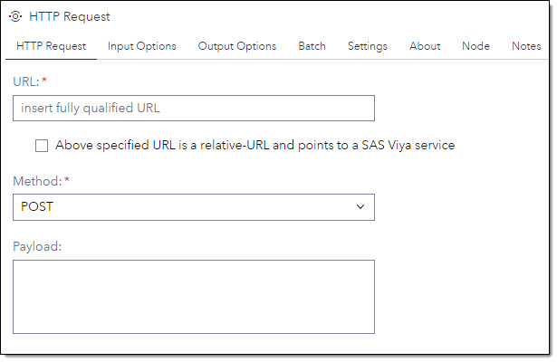
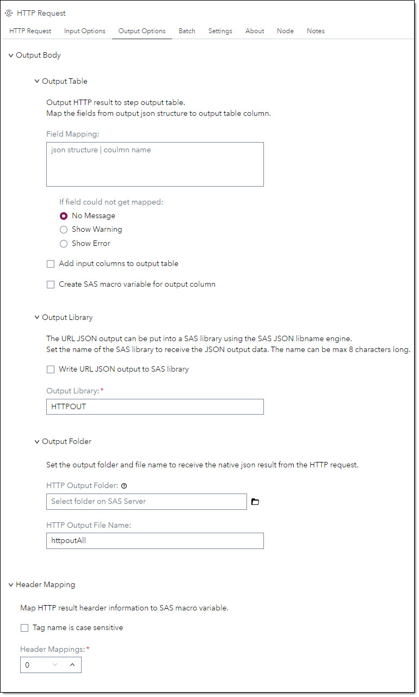

# HTTP Request 

## Description 
The HTTP Request step allows you to send HTTP/1.1 requests. The step is using PROC HTTP to execute the HTTP requests. 
You can use this step to validate data, enrich data in your data flow, update data via a REST call and more. 
There are various ways to receive data from the HTTP Request in order to use the HTTP result downstream.

## User Interface 

### HTTP Request tab 
At the HTTP Request tab you set general information for the http request.

   | Standalone mode | Flow mode |
   | --- | --- |                  
   |  |  |

   | UI Field | Comment|
   | --- | --- |
   | URL |Specify the fully qualified URL path that identifies the endpoint for the HTTP request.<br><br>If the URL has url parameters you need to mask the ampersand (&) sign. The & needs to be followed by a dot (.) e.g.:<br> ```https://myserver.com/search?name=Bob&.city=London```<br><br>You can also use SAS macros in the URL. In this case you must not mask the ampersand e.g.:<br>```https://&myserver/search?name=Bob&.city=London```<br><br>If you have an input table the URL will be called for each row in the table. You can pass in the column values for each row into the URL using the column names as parameters. The column name needs to be masked with a leading a tailing at-sign (@) in the URL e.g.:<br>```https://myserver.com/search?name=@firstname@&.city=@city@```<br><br>**Note:** If an ampersand for a URL parameter is not masked you will get a warning that a macro name cannot be resolved! |
   | Use SAS Internal Viya API | Check this box if you want to execute a SAS Internal API for the current instance. Insert the URL without server information (e.g.: /referenceData/domains).
   | Method | Select a HTTP method from the drop down list. |
   | Payload | Specify the input data for the HTTP request.<br><br>If you have an input table you can pass in the column values for each row into the payload using the column names as parameters. The column name needs to be masked with a leading a tailing at-sign (@) in the payload e.g.:<br>```{ "name"="@firstname@", "city"="@city@" }```<br>You can also use SAS macros in the payload e.g.:<br>```{ "name"="@firstname@", "city"="&TOWN" }``` |

### Input Options tab 
At the Input Options tab you specify  input parameters for the HTTP request.

   | Standalone mode | Flow mode |
   | --- | --- |                  
   |  |  |

   | Section | UI Field | Comment|
   | --- | --- | --- |
   | Headers | Header Lines | Set the number of header lines you want to submit. You can submit up to 8 header lines |
   || Header Line | Each header line has the format *'header' = 'value'* e.g.:<br>```"Content-Type": "application/json"```<br>The default value for header line 1 is set to "Content-Type": "application/json". If not appropriate you can to change the value. | 
   | Authorization | Auth Type | Select how to authorize for the HTTP request. |
   ||| **No Auth** - Specifies that no authorization is used for the HTTP request. |
   ||| **Basic Auth** - Specifies to use user identity authentication to authenticate the connected server. The user name and password are supplied in the fields *Username* and *Password*. |
   ||| **Bearer Token** - Specifies to sends an OAuth access token along with the HTTP call. The token value is supplied in field *token*. |
   | Timeout | | Set the number of seconds of inactivity to wait before cancelling the HTTP request. The default is 0 which indecates that there is no timeout. |

### Output Options tab 
At the Output Options tab you specify how to receive the data comming back from the HTTP request.

   | Standalone mode | Flow mode |
   | --- | --- |                  
   |  |  |
#### Output Body 
If the output format is json you can specify fields from the json structure to land in the output table.

   | Section | UI Field | Comment|
   | --- | --- | --- |
   | Output Table | Field Mapping | In the field mapping text box point to the field in the json structure that you want to output to the step's output table.<br>For information to map the fields see [Field Mapping](#fieldmapping-) |
   || If field could not get mapped | If the field to be mapped cannot be found the map-column will be set to null. This can happen either because the map field does not exist in the json structure in general (typo when mapped) or there was no value returned for the field and hence it is missing in the json structure. In both cases the map-column will be set to null. You can set one of the three option to react to it:<br>* **No Message** - No message pops up if a field is missing.<br>* **Show Warning** - The SAS job will throw a warning message.<br>* **Show Error** - The SAS job will throw an error message and aborts the job. |
   || Add input columns to HTTP output table | If an input table exists, the step will output both input columns and output columns in the output table. |
   || Create macro for output column | The step will create a macro for the mapped fields from the json structure. If the input table has more than one row only the values from the first result row will mapped to macros. The macros have the same names like the mapped column names. |
   | Output Library || The json result from the HTTP request will be put in a SAS library using the json engine. The datasets in the library represent the json structure. This enables you to access the HTTP result using other steps like *Query* for example. |
   || Output to SAS library | Indicates whether to output the HTTP result to a SAS library. Default is not to write to a SAS Library. |
   || Output Library | Set the name of the SAS output library. The lib name can be up to 8 characters long. The default name is *HTTPOUT*. |
   | Output Folder || The step can write the HTTP result to a file.<br>You can write the HTTP output to a file and then use the file in other steps, for example, opening the file in Python for further processing. |
   || HTTP Output Folder | Select the folder for the HTTP output file. The folder must be a folder on SAS Server. |
   || HTTP Output File Name | Set the name for the HTTP result file without file suffix. The default name is *httpoutAll*. This will create a file named *httpoutAll.json*.<br>The output file contains the output for all records passed through the step in json format. A key will indecate the record number. For example, if the step had three input records the format of the file will look like this:<br>```{"1":"-http result for rec 1-", "2":"-http result for rec 2-", "3": "-http result for rec 3-"}``` |

#### Field Mapping <a name="fieldmapping-"></a>
Field mapping offers you a convenient way to map fields from the result json structure to a column in the output table.<br>
The mapping format is: *json structure path | map column name*<br>
For Example, assuming you have a json result like this:
```
                                           | zip              | country         |
{                                          | ---------------- | --------------- |
    "status": 200,                         |                  |                 |
    "result": [                            | *** result ***   | *** result ***  |
        {                                  |                  |                 |
            "query": "U3 4AB",             |                  |                 |
            "result": null                 |                  |                 |
        },                                 |                  |                 |
        {                                  | *** 1 ***        | *** 1 ***       |
            "query": "AL3 8EE",            |                  |                 |
            "result": {                    | *** result ***   | *** result ***  |
                "postcode": "AL3 8EE", --> | *** postcode *** |                 |
                "quality": 1,              |                  |                 |
                "eastings": 507817,        |                  |                 |
                "northings": 214437,       |                  |                 |
                "country": "England"   ----+----------------> | *** country *** |
            }                              |                  |                 |
        }                                  |                  |                 |
    ]                                      |                  |                 |
}                                          |                  |                 |

```
You want to map the fields *postcode* and *country* from row 2 of array *result* to columns *zip* and *country*. The mapping structure will look like this:
```
result/1/result/postcode | zip,
result/1/result/country  | country
```
This will produce an output table with columns *zip* and *country* with values from json fields *postcode* and *country*.

**Note:** If you point at a json array the whole json array will be copied into the column. For the above structure if you point at ```result/0 | allinfo``` the value of column *allinfo* looks like this ```{"query": "U3 4AB", "result": null}```.

#### Header Mapping ####
In the Header Mapping section you can map tag from the HTTP header result to SAS macro variables.
   
   | UI Field | Comment|
   | --- | --- |
   | Header Mappings | Set the number of tags you want to map from the HTTP header result. |
   | Edit Line | Set the to tag and macro variable to map. The mapping format is: *Header Tag : Macro Variable Name* |
   | Tag name is case sensitive | Indicate to look for the tag in case sensitive mode. Default is not case sensitive. |
   
#### Header Mapping ####
Under Options you can set additional options.

   | UI Field | Comment|
   | --- | --- |
   | HTTP Debug Level | Set the debug level for this step. You can set level 1 - 3. Depending on the level PROC HTTP will write additional information to the log. |


   

