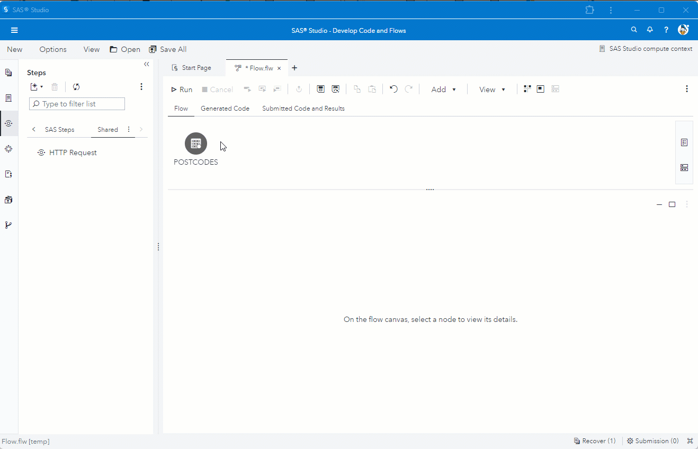

# Enrich data flow using POST method
The example is calling to a REST API using the POST method to enrich UK postal codes county, council and parish information.<br>
Columns from the input table are used as parameters in the payload.<br>
The required fields from the HTTP result are mapped to columns in the output table.<br>
The columns from the input table are also passed through to the output table.<br>
The output columns are re-ordered in an final step.



To recreate the example in SAS Studio use the following settings for HTTP Request step and use the code to create the input data.

### HTTP Request - step
#### HTTP Request - tab
**URL**
```
http://api.postcodes.io/postcodes
```
**Method**<br>
* Set method to ***POST***.

**Payload**
```
{
"postcodes" : ["@PO1@", "@PO2@", "@PO3@"]
}
```

#### Input Options - tab
**Headers**
```
"Content-Type"="application/json"
```
```
"Accept"="application/json"
```

#### Output Options - tab
**Field Mapping**
```
result/0/result/admin_county    | county_1,
result/0/result/admin_district  | council_1,
result/0/result/parish          | parish_1,
result/1/result/admin_county    | county_2,
result/1/result/admin_district  | council_2,
result/1/result/parish          | parish_2,
result/2/result/admin_county    | county_3,
result/2/result/admin_district  | council_3,
result/2/result/parish          | parish_3
```

### Manage Columns - step
* Reorder the HTTP output columns to set the *postal code* columns before the appropriate *county*, *council* and *parish* columns.

 ---
 
### Test Data
```
data postcodes;
	length po1-po03 $10;
	infile cards dlm=",";
	input po1 po2 po3 $;
	cards;
AL3 8EE,AL4 0RQ,W2 1JU
OX49 5NU,M32 0JG,NE30 1DP
;
run;
```
