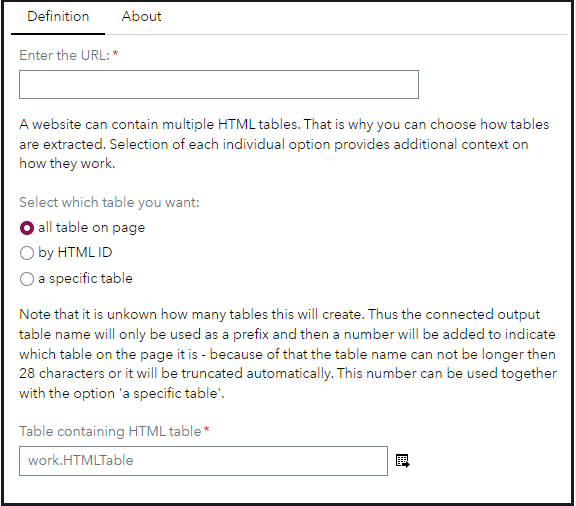
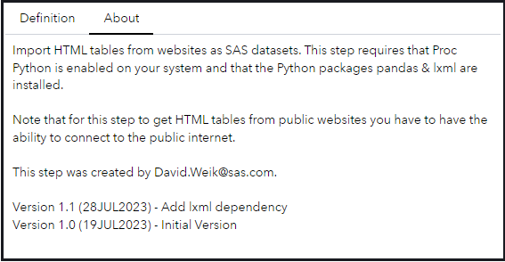

# Import - HTML Table

## Description

The **Import - HTML Table** custom step enables SAS Studio users to import HTML tables from other websites as SAS tables. This step requires that Proc Python is enabled on your system and that the Python packages *pandas* & *lxml* are installed.

## User Interface

* ### Definition tab ###

   

* ### About tab ###

   

## Finding the right table

You can choose to extract tables from website in three modes:

1. *all table on a page* - this will extract all of the HTML table that are on the website. Each will be saved to a separate dataset. The output table that you specified serves as a prefix and the tables will be added with an _X where X is equal which table on the page it is, i.e. first, second, etc.
2. *by HTML ID* - this enables you to specify an ID and a HTML table that has that ID will be saved as a dataset. This is usually the most robust and consistent way to ensure that you get the right table - as IDs tend to be consistent during the lifetime of a website. You can check if your desired HTML table element has an ID by right clicking the table in your browser, selecting the Inspect Element option from the context menu. Now you are in the developer console of your browser and you can see the HTML structure of the web page. Check if the table element has an ID attribute and if so copy its value and paste it below. You can also search in the developer console (*CTRL+F*) for all HTML table that have an ID by using the following CSS selector in the search box: **table[id]**
3. *a specific table* - If a website contains multiple tables and you want only one specific table, but that table doesn't have an ID then you can make use of this option. The value below selects the nth table that is available on the website. To get this number it is recommended that you first run this step in the 'all table on page' mode and then take the number that was added as a postfix for the table and set its value below

## Requirements

SAS Viya 2023.07 or later

Python 3.8 or later

**Python packages:**

- pandas

- lxml

## Usage

Find a demonstration of this step in this YouTube video: [Import - HTML Table | Custom Step](https://youtu.be/Q6TMItBNxqA)

## Change Log

* Version 1.1 (28JUL2023)
    * Document lxml dependency
    * Add explicit error if pandas & lxml are not installed
* Version 1.0 (19JUL2023)
    * Initial version
