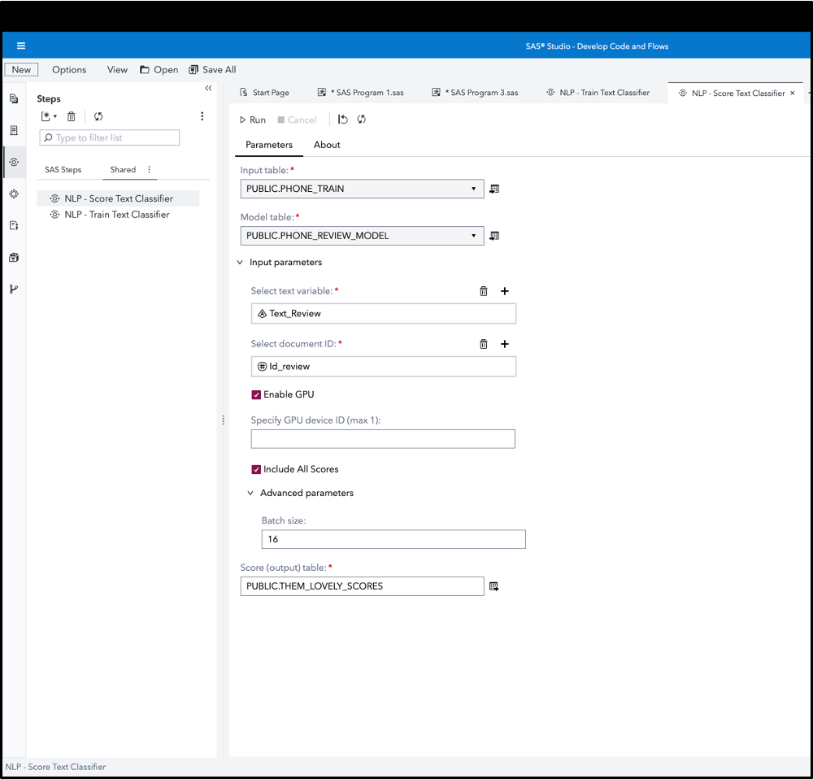

# Natural Language Processing (NLP) - Score Text Classifier

This custom step enables you to score a text corpus with a text classifier model trained using the deep learning (BERT-based) textClassifier.trainTextClassifier action. 

It uses the recently introduced SAS Visual Text Analytics (VTA) CAS action, textClassifier.scoreTextClassifier.  This augments SAS approaches for Natural Language Processing-based classification models (in addition to rules-based classification). More details in the documentation (link provided below).

Use this to classify customer reviews as per a star rating, carry out sentiment analysis, prioritize customer complaints, identify serious adverse events, and many other classification use-cases.

Use of this custom step requires a SAS Visual Text Analytics (VTA) license.

## Screenshot

## SAS Viya Version Support
Tested in Viya 4, Stable 2023.02, with a GPU.

## Requirements

1. A SAS Viya 4 environment (monthly release 2023.02 or later) with SAS Studio Flows.

2. **At runtime: an active connection to CAS:** This custom step requires SAS Cloud Analytics Services (CAS). Ensure you have an active CAS connection available prior to running the same.

3. A SAS Visual Text Analytics (VTA) license.

4. A GPU is preferred, due to its better performance.  However, note that availability and cost of GPU resources are however constraints for many environments.  Please expect significantly longer training times while using CPU resources.

## User Interface

### Parameters:

Note that this custom step runs on data loaded in SAS Cloud Analytics Services (CAS). Ensure you are connected to CAS before running this step.

#### Input parameters:

1. Input table: connect a CAS table containing text you wish to be scored to the "Input table" input port. The table should contain at least one character / varchar variable with the text to be scored, along with a document ID.

2. Model table: connect a CAS table to the "Model table" input port.  This should be an in-memory table which was trained using the textClassifier.trainTextClassifier action.

3. Text variable: select a variable containing the text you wish to classify.  Ensure you select either a char or varchar variable.

4. Document ID: select a column which can act as an identifier for your text observation. 

5. Enable GPU: choose between using GPU or CPU resources to classify your data.  GPUs are recommended due to their performant nature.  At the same time, note that GPUs may not be readily available in all Viya environments, and may lead to higher cloud costs.  Check with your SAS administrator on the availability of GPU resources.

6. As an optional step, if you select Enable GPU, you may choose to provide the device ID of the GPU you wish to use.  Currently, the action allows for only 1 GPU device to be used.

7. Include all scores: check this box if you would like text classification scores for all labels to be appended to the observation.  Otherwise, the output table will contain only the predicted label and its score.
 
8. Advanced parameters: you may change the batch size  hyperparameter to a higher or lower value as suggested by documentation. Note this will affect the performance of the scoring process. Refer documentation (below) for more details.

#### Output table specifications:

- Output port: connect an output CAS table to contain the scored output.

## Documentation:

- The [textClassifier.scoreTextClassifier CAS action](https://go.documentation.sas.com/doc/en/pgmsascdc/default/casvtapg/cas-textclassifier-scoretextclassifier.htm)

## Installation & Usage
1. Refer to the [steps listed here](https://github.com/sassoftware/sas-studio-custom-steps#getting-started---making-a-custom-step-from-this-repository-available-in-sas-studio).

## Created / contact : 

- Sundaresh Sankaran (sundaresh.sankaran@sas.com)

## Change Log

Version : 1.0.   (19MAR2023)