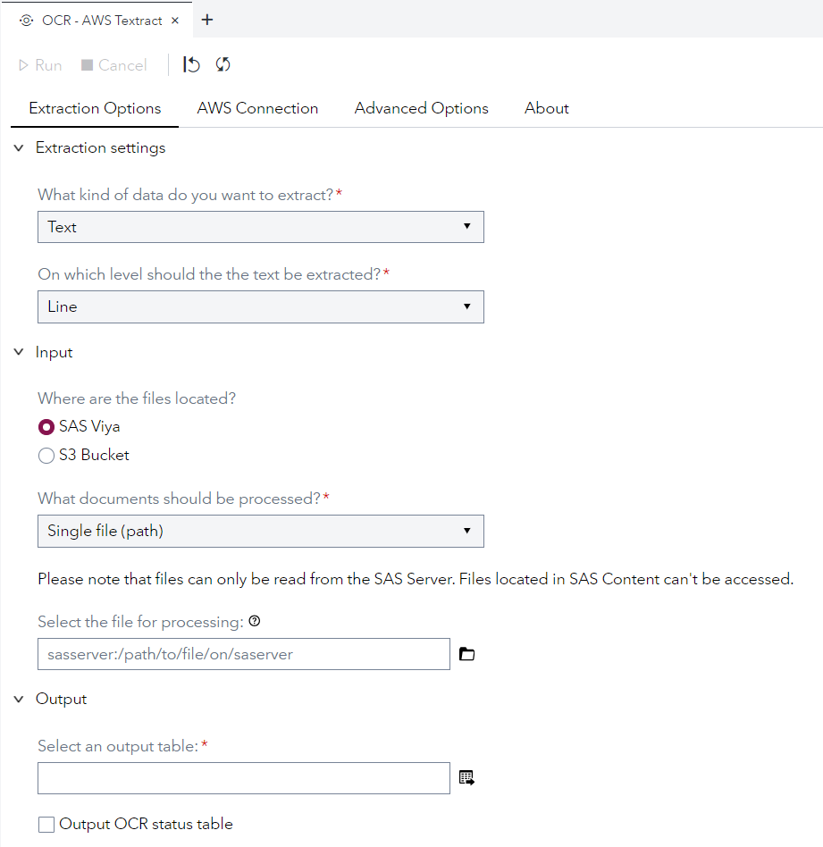
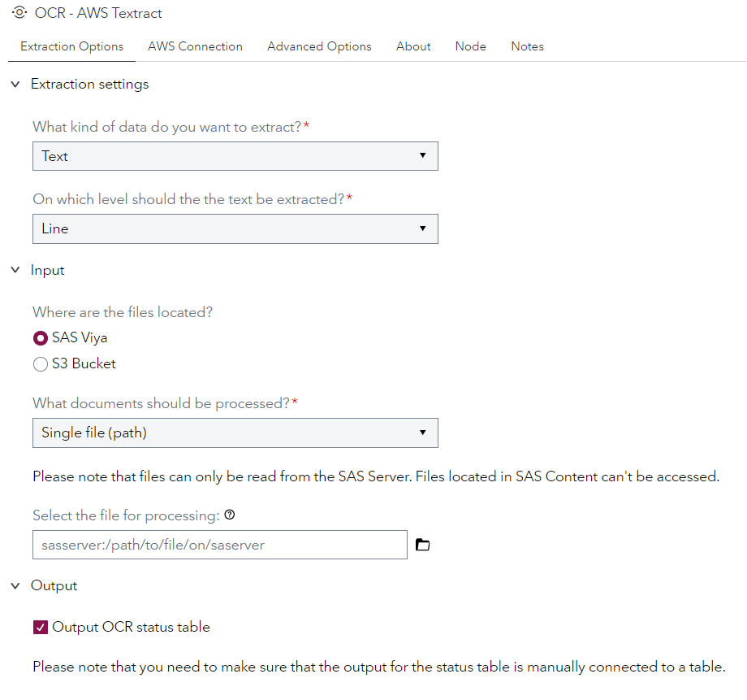
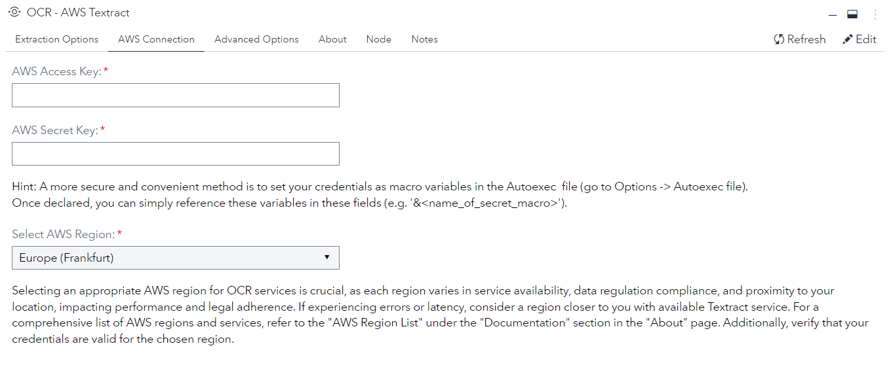
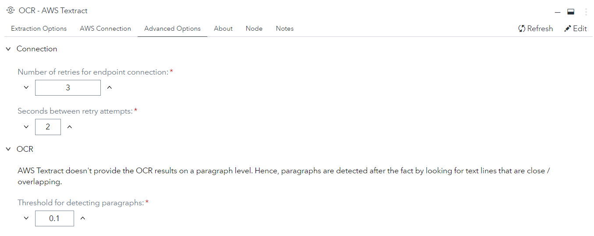
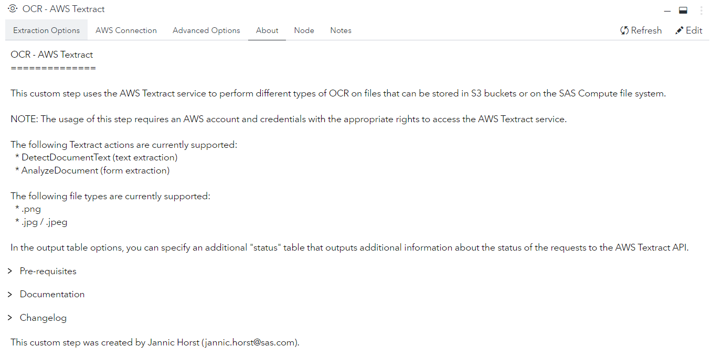

# OCR - AWS Textract

## Description

This custom step uses the AWS Textract](https://aws.amazon.com/textract/) service to perform different types of [OCR](https://en.wikipedia.org/wiki/Optical_character_recognition) on files that can be stored in S3 buckets or on the SAS Compute file system.

### Features
- Text Extraction (Words / Lines / Paragraphs / Pages)
- Form Extraction (Key-Value)
- Supports: Local Files (SAS Viya) & Files in S3 Bucket

## User Interface
* ### Options tab ###

   | Standalone mode | Flow mode |
   | --- | --- |                  
   |  |  |

* ### AWS tab ###

   
  
* ### Advanced tab ###

   

* ### About tab ###

   

## Requirements

Tested on SAS Viya version Stable 2022.09

### Python Packages
- [boto3](https://pypi.org/project/boto3/)
- [pandas](https://pypi.org/project/pandas/)
- [numpy](https://pypi.org/project/numpy/)

### AWS Credentials
To use this step an aws key & secret are required as credentials as well as an AWS region.
- [AWS Credential Management (IAM)](https://docs.aws.amazon.com/textract/latest/dg/security-iam.html)
- [AWS Region List](https://docs.aws.amazon.com/general/latest/gr/textract.html)

### Supported File Types
> In the current implementation, AWS Textract doesn't support PDF files.
- .jpg/.jpeg
- .png

## Usage
> **Note:** This step works well with the following custom step [Create Listings of Directory - CLOD](https://github.com/sassoftware/sas-studio-custom-steps/tree/main/Create%20Listing%20of%20Directory%20CLOD) to create the input file-list based on a folder of documents. 

### Testdata
Here is a list of test documents
- [Patient Intake Form Sample](https://github.com/aws-samples/amazon-textract-code-samples/blob/master/python/patient_intake_form_sample.jpg)
- [Handwritten Form Sample](https://www.nist.gov/image/sd19jpg)

> **Pro Tip:** Take a photo with your smarphone, make a screenshot of a document or export a PowerPoint slide as .jpg/.png

## Parameters
### Options
X = Always Required | O = Required (for certain settings) |  = No user input required
| Parameter           | Required | Type    | Description                                                                                        |
|---------------------|:--------:|---------|----------------------------------------------------------------------------------------------------|
| Extraction Type     | X        | Option  | Specifies the AWS Textract action that is called. For text: DetectDocumentText, for forms: AnalyzeDocument |
| Extraction Level    | X        | Option  | The level of aggregation of the detected text. Possible values: Word, Line, Paragraph, Text       |
| File Location       | X        | Option  | Specifies whether the files are stored locally or in a S3 bucket                                   |
| Input Type          | X        | Option  | Specifies which documents should be processed. For local files (SAS Viya): Single file, list of files (table), For S3 Bucket: list of files (table), or a whole bucket |
| File Path           |O          | Path    | File to be processed. Only when "SAS Viya" and "just one file" is selected                             |
| File List           |O          | Table   | Table containing list of files. Only when a "list of files" is selected                            |
| Document Path Column|O          | Column  | Column that contains the file paths. Only when "list of files" is selected                         |
| S3 Bucket Name      | O        | String  | Name of the S3 bucket containing the files. Only when "S3 Bucket" is selected                      |
| Output Status Table |         | Option  | Whether status tracking information about the processing should be in the output                    |

### AWS
| Parameter  | Required | Description |
|---------------------|:----------:|--------------------------------|
|AWS Access Key| X | Access Key |
|AWS Secret Key|X| Secret Key |
|AWS Region |X| Region of the AWS endpoint and S3 bucket (if "S3 Bucket" is selected) |
### Advanced
| Parameter  | Required | Description |
|---------------------|:----------:|--------------------------------|
|Number of Retries|  |How many retries attempts before a document is skipped|
|Seconds between retries|| How many seconds between retry attempts|
|Pragraph Detection Threshold|| AWS Textract doesn't provide the OCR results on a paragraph level. Hence, paragraphs are detected after the fact by looking for text lines that are close / overlapping|

## Change Log
* Version 1.0 (13SEP2022) 
    * Initial version
