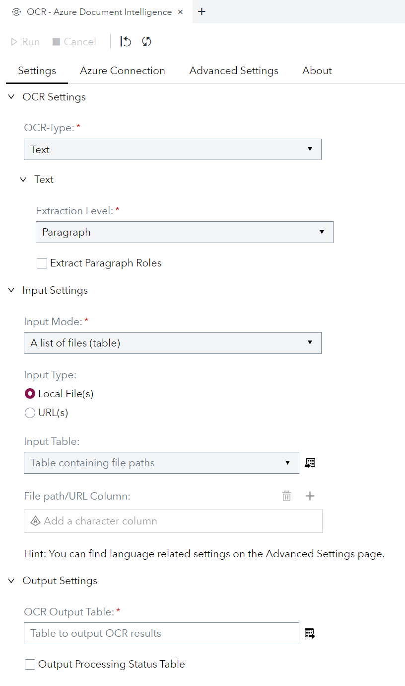
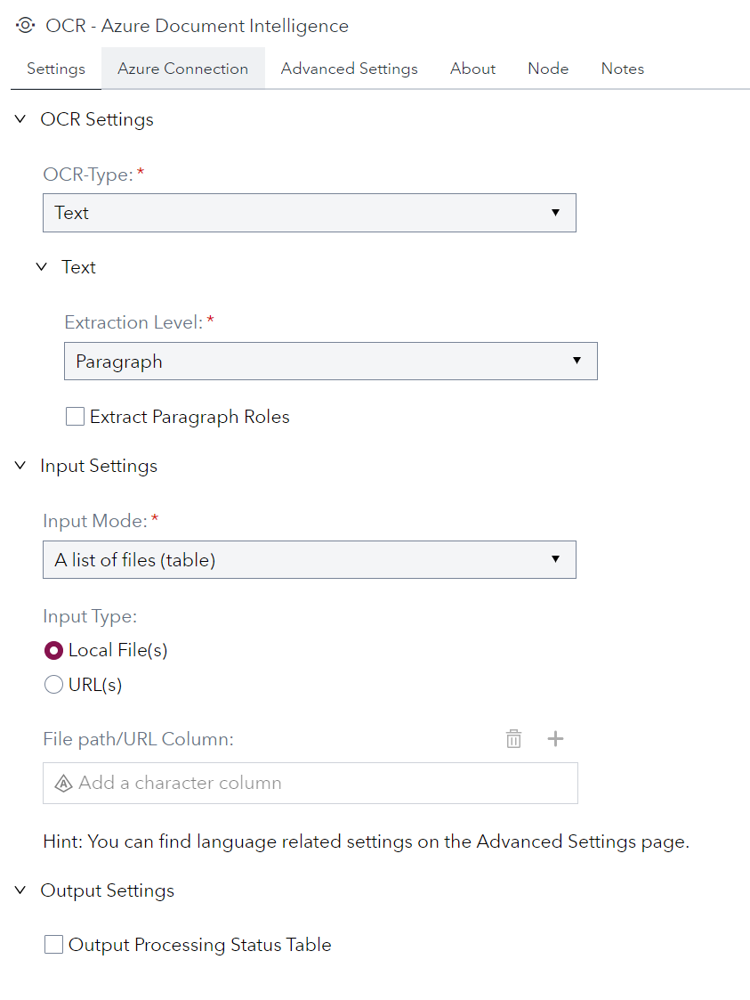
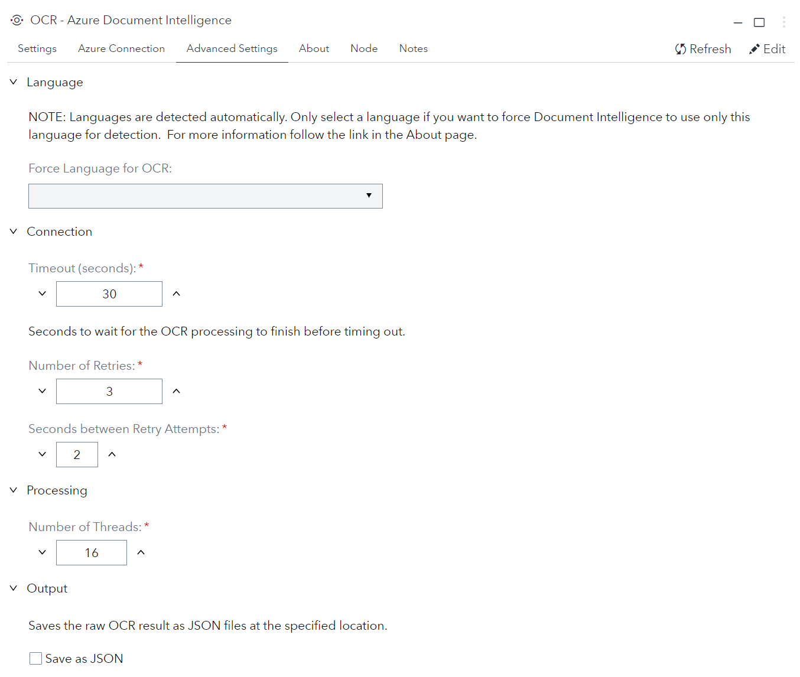
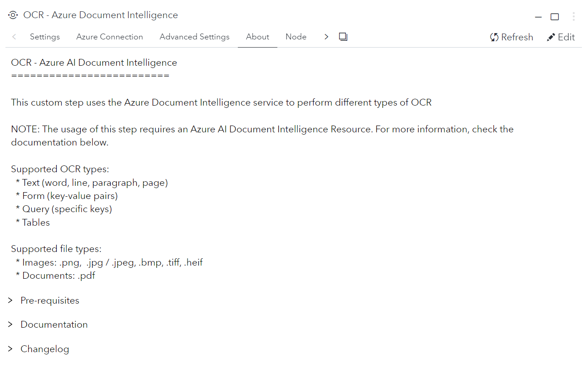

# OCR - Azure AI Document Intelligence

> Replaces the  "OCR - Azure AI Document Intelligence **Table Extraction**" custom step

This custom step uses the [Azure AI Document Intelligence](https://azure.microsoft.com/en-us/products/ai-services/ai-document-intelligence) service to perform different types of [OCR](https://en.wikipedia.org/wiki/Optical_character_recognition) on files that are stored on the SAS file system. [What is Azure AI Document Intelligence?](https://learn.microsoft.com/en-us/azure/ai-services/document-intelligence/overview?view=doc-intel-4.0.0)

## ✨ Features
- ✅ Text Extraction (words / lines / paragraphs / pages / document)
- ✅ Form Extraction (key-value pairs)
- ✅ Query Extraction (extraction of specified keys)
- ✅ Table Extraction
- ✅ Local Container Support
## 📖 Contents
- [💻 User Interface](#user-interface)
- [👩‍💻 Usage](#usage)
- [📋 Requirements](#requirements)
- [⚙️ Settings](#settings)
- [📚 Documentation](#documentation)
- [📝 Change Log](#change-log)

<a name="user-interface"/>

## 💻 User Interface
* ### Settings tab ###
   | Standalone mode | Flow mode |
   | --- | --- |                  
   |  |  |

* ### Azure Settings tab ###

* ### Azure connection tab ###
  

* ### Advanced settings tab ###
  

* ### About tab ###
  

<a name="usage"/>

## 👩‍💻 Usage

> **Note:** This step works great with the [Create Listings of Directory - CLOD](https://github.com/sassoftware/sas-studio-custom-steps/tree/main/Create%20Listing%20of%20Directory%20CLOD) custom step  to create the input file-list based on a folder of documents. 

### 📺 Tutorial (👇Click Thumbnail👇)
[IN PROGRESS]

### Feature Matrix

<table>

  <tr>
    <td></td>
    <td colspan="3" align="center">File Formats</td>
    <td colspan="2" align="center">OCR Processing</td>
  </tr>
  <tr>
    <th>Extraction</th>
    <th>PDF</th>
    <th>Image1</th>
    <th style="border-right: 1px solid #FFF;">URL</th>
    <th>Azure2</th>
    <th>Local Container3,4</th>
  </tr>
  <tr>
    <td>Text</td>
    <td align="center">✅</td>
    <td align="center">✅</td>
    <td align="center" style="border-right: 1px solid #FFF;">✅</td>
    <td align="center">✅</td>
    <td align="center">✅</td>
  </tr>
  <tr>
    <td>Form</td>
    <td align="center">✅</td>
    <td align="center">✅</td>
    <td align="center" style="border-right: 1px solid #FFF;">✅</td>
    <td align="center">✅</td>
    <td align="center">✅</td>
  </tr>
  <tr>
    <td>Query</td>
    <td align="center">✅</td>
    <td align="center">✅</td>
    <td align="center" style="border-right: 1px solid #FFF;">✅</td>
    <td align="center">✅</td>
    <td align="center"></td>
  </tr>
  <tr>
    <td>Table</td>
    <td align="center">✅</td>
    <td align="center">✅</td>
    <td align="center" style="border-right: 1px solid #FFF;">✅</td>
    <td align="center">✅</td>
    <td align="center">✅</td>
  </tr>
</table>

$^1$ JPEG/JPG, PNG, BMP, TIFF, HEIF
| $^2$ API-Version `2023-10-31-preview` (4.0) 
| $^3$ API-Version `2022-08-31` (3.0)  
$^4$ Only supports `General Document` Model / Container

### Test data
- [Sample forms on Github](https://github.com/Azure/azure-sdk-for-python/tree/main/sdk/documentintelligence/azure-ai-documentintelligence/samples/sample_forms)
- [Handwritten Form Sample](https://www.nist.gov/image/sd19jpg)

> **Pro Tip:** Take a photo with your smartphone, make a screenshot of a document or export a PowerPoint slide as image / PDF.

<a name="requirements"/>

## 📋 Requirements

Tested on SAS Viya version Stable 2024.01

### 🐍 Python
- [Python 3](https://www.python.org/downloads/)

### 📦 Packages
- [numpy](https://pypi.org/project/numpy/)
- [pandas](https://pypi.org/project/pandas/)

### 🤖 Azure AI Document Intelligence Resource
To use this step the endpoint and key for an Azure Document Intelligence Resource is needed.   👉 [Create a Document Intelligence resource](https://learn.microsoft.com/en-us/azure/ai-services/document-intelligence/create-document-intelligence-resource?view=doc-intel-4.0.0)

<a name="settings"/>

## ⚙️ Settings

### General
| Parameter   | Required      | Description                                                      |
|-------------|:---------------:|------------------------------------------------------------------|
| OCR Type    | Yes           | Defines the type of Optical Character Recognition (OCR) to use   |
| Input Mode  | Yes           | Indicates if processing a list of files or a single file         |
| Input Type  | Yes           | Indicates if local documents or document URLs are used as input        |
| File Path   | No*           | The file path for processing a single file                       |
| Input Table | No†           | The name of the table containing file paths/URLs for batch processing |
| Path Column | No†           | The column in the input table that contains the file path/URL    |

\* Required if ``Input Mode`` is set to *"single"*.  
† Required if ``Input Mode`` is set to *"batch"*.

  
Text Settings

  
| Parameter            | Required | Description                                                                                     |
|----------------------|:--------:|-------------------------------------------------------------------------------------------------|
| Granularity |    Yes     | Defines granularity of the text output (e.g. word, line, paragrpah, page).  Has implications regarding extraction output (e.g. 'role' only for paragraphs, 'confidence' only for words/pages)<ul><li>**word** -  includes *confidence* value</li><li>**line** - text line per row</li><li>**paragraph** - blocks of text, can include 'role' of a given paragraph (heading, etc..)</li><li>**page** - everything one one page</li><li>**document** - everything in the document</li></ul> |

  
Query Settings

  
| Parameter       | Required | Description                                                                                                         |
|-----------------|:--------:|---------------------------------------------------------------------------------------------------------------------|
| Query Fields    |    Yes    | List of keys that are used as queries in the extraction process.                                                    |
| Exclude Metadata|    No    | If set to 'yes', all meta information from the extraction will be ignored, and the output will only contain a column per key and a row per file. |

  
Table Settings

  
| Parameter             | Required | Description                                                                                                               |
|-----------------------|:--------:|---------------------------------------------------------------------------------------------------------------------------|
| Table Output Format   |    Yes    | Defines the output format for table extraction: <ul><li>**map** - outputs (col_id, row_id, value) for later reconstruction</li><li>**reference** - outputs a row per table with a uuid as reference, stored in the defined library</li><li>**table** - outputs one table through standard output, supports only one table and one file</li></ul> |
| Table Output Library  |    No*    | Defines the output library for extracted. tables                                  |
| Select Tables         |    No†    | Defines if a table per document is selected.                                                          |
| Table Selection Method|    No    | Defines the method to select the table per document that is extracted: <ul><li>**index** - uses the index to select the extracted table.</li><li>**size** - selects the table with the most cells.</li></ul> |
| Table Index           |    No‡    | Table index to extract.                                                    |

\* Only available if ``Table Output Format`` is set to *"reference"*.  
† Defaults to true when ``Table Output Format`` is *"table"*.  
‡ Required if ``Table Selection Method`` is set to *"index"*

### 🔐 Azure
| Parameter  | Required | Description |
|---------------------|:----------:|--------------------------------|
|Endpoint URL| Yes | AI Document Intelligence Resource Endpoint |
|Key |Yes| Secret Key |
|Local Container |No| Whether or not to use a locally deployed Document Intelligence container. Please make sure to deploy the `General Document` container.   |
|Container Endpoint |No*| URL and Port of the locally deployed container.|

\* Required if `Local Container` is set to `True`.  

  
👉Where to find resource key and endpoint

  

### 🧙‍♂️ Advanced

| Parameter  | Required | Description |
|---------------------|:----------:|--------------------------------|
|Force Language| No |Option to force Document Intelligence to use only a specific language for OCR. Note: Languages are detected automatically by default.|
|Timeout†| No |How many seconds to wait for the OCR process to finish for document before timing out.|
|Number of Retries| No |How many retries attempts before a document is skipped|
|Seconds between retries|No| How many seconds between retry attempts|
|Number of Threads|No|How many Python threads will be used to process all files.|
|Save as JSON|No|Whether to save the raw output as JSON (one file per document)|
|Output Folder|No*|Folder for the JSON files.|

† Note: Make sure to set this high enough if your documents are excessively large.  
\* Required if ``Save as JSON`` is set to *true*.

<a name="documentation"/>

## 📚 Documentation
- [What is Azure AI Document Intelligence?](https://learn.microsoft.com/en-us/azure/ai-services/document-intelligence/overview?view=doc-intel-4.0.0)
- [Azure AI Document Intelligence documentation](https://learn.microsoft.com/en-US/azure/ai-services/document-intelligence/?view=doc-intel-4.0.0&viewFallbackFrom=form-recog-3.0.0&branch=release-build-cogserv-forms-recognizer)
- [Pricing](https://azure.microsoft.com/en-us/pricing/details/ai-document-intelligence/#pricing)
- [Language Support](https://learn.microsoft.com/en-GB/azure/ai-services/document-intelligence/language-support-ocr?view=doc-intel-4.0.0&tabs=read-print%2Clayout-print%2Cgeneral)
- [Data Privacy](https://learn.microsoft.com/en-us/legal/cognitive-services/document-intelligence/data-privacy-security)
- [Install and Run Local Document Intelligence Containers](https://learn.microsoft.com/en-us/azure/ai-services/document-intelligence/containers/install-run?view=doc-intel-3.0.0&preserve-view=true&tabs=general-document#run-the-container-with-the-docker-compose-up-command)
  
<a name="change-log"/>

## 📝 Change Log
Version 1.0 (22MAR2024) 
* Renamed step to "OCR - Azure AI Document Intelligence" 
* Added support for text, form and query extraction
* Added support for extracting multiple tables at once
* Added support for processing multiple files at once
* Added support for local document intelligence container
* Added option to output status table
* Added multithreading 
* Upgraded used API version to Document Intelligence 4.0

Version 1.0 (02JAN2024) 
* Initial Version

