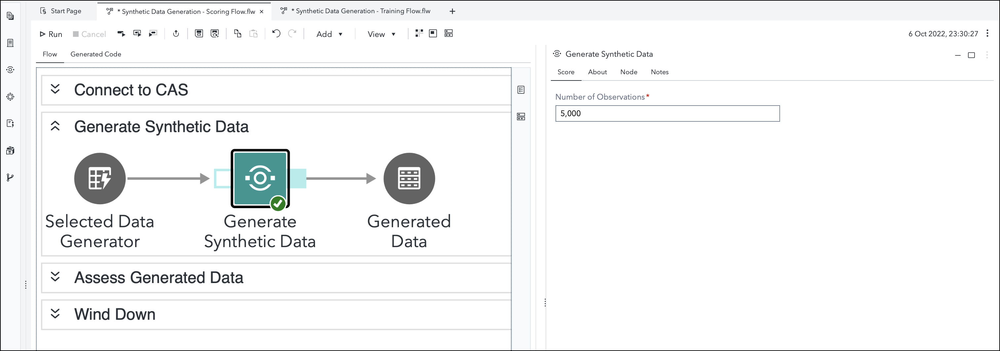

# Generate Synthetic Data through Generative Adversarial Networks (GANs)

## Description
This custom step enables you to generate synthetic data using a trained GAN model.  Synthetic data helps you make better data-informed decisions, even in situations where you have imbalanced, scant, poor quality, unobservable, or restricted data.  
  
Once you have generated synthetic data, you can carry out further downstream activities such as comparing distributions to see how close your synthetic data resembles the original.

A general idea :


Read this [blog](https://communities.sas.com/t5/SAS-Communities-Library/SAS-for-Synthetic-Data-Generation-in-Martech/ta-p/837716) for a general overview of applying these steps (taking Marketing Intelligence as an example).


## SAS Viya Version Support
Tested in Viya 4, Stable 2022.09
<mark> New test in Viya 4, Stable 2024.10 </mark>

## User Interface

This custom step runs on data loaded to a SAS Cloud Analytics Services (CAS) library (known as a caslib). Ensure you have access to a CAS engine before running this step.


**Refer the "About" tab on each of the individual steps for more details on what they are used for.**

### Input Parameters

- An input table containing the model binary (known as an astore) which has been trained earlier - attach this to the input port of this step.

### Configuration

1. Enable GPU (check box; default is disabled): check this box in case you wish to enables Graphical Processing Units (GPUs) for scoring.

  Note that currently the tabularGan procedure (which outputs the GAN model for synthetic data) is designed to take advantage of a maximum of 1 GPU device only, and the scoring procedure does the same.

2. Provenance variable (text field; default value of  SYNTHETIC_DATA_FLAG): modify this field if you want to create a column of a different name, which indicates that the data is synthetic (value of 1).

### Output Specifications

1. Number of synthetic observations you wish to generate.

2. Set up the output for this process by attaching a table to the output port (called Generated Data) 




#### Run-time control

> **Note that this is optional.**  

*Generating synthetic data may not be required for all scenarios (based on initial balance levels of data).  Therefore, you may find it useful to employ the following control in some situations, as dictated by logic.*

In some scenarios, you may wish to dynamically control whether this custom step runs or simply "passes through" without doing anything, in a SAS Studio session. The following macro variable is set to initialize with a value of 1 by default, indicating an "enabled" status and allowing the custom step to run.

Refer this [blog](https://communities.sas.com/t5/SAS-Communities-Library/Switch-on-switch-off-run-time-control-of-SAS-Studio-Custom-Steps/ta-p/885526) for more details on the concept.

```sas
/* To demonstrate the default value of the trigger macro variable */;

&_gsd_run_trigger.=1;
```

If you wish to control execution of this custom step programmatically (within a session, including execution of a SAS Studio Flow), make sure that an upstream SAS program sets the macro variable to 0.  Setting the value to 0 "disables" the execution of this custom step.

For example, to "disable" this step, run the following code upstream:

```sas
%global _gsd_run_trigger;
%let _gsd_run_trigger=0;
```

To "enable" this step again, run the following (it's assumed that this has already been set as a global variable):

```sas
%let _gsd_run_trigger=1;
```

**Important:** Be aware that disabling this step means that none of its main execution code will run, and any  downstream code which was dependent on this code may fail.  Change this setting only if it aligns with the objective of your SAS Studio program.

## Requirements

1. A SAS Viya 4 environment (latest test on monthly release 2024.10) with SAS Studio Flows.
2. An active connection to SAS Cloud Analytics Services.
3. In case you wish to use GPUs, check with your administrator on whether GPUs are available in your environment for SAS Cloud Analytics Services (CAS) to access.

## Installation & Usage

Refer to the [steps listed here](https://github.com/sassoftware/sas-studio-custom-steps#getting-started---making-a-custom-step-from-this-repository-available-in-sas-studio).

If you want to use the Home Equity sample data (HMEQ) used in the screenshots above to get started with these custom steps, then you can make them available in your SAS Studio session. This sample data set is part of the SAS sample data library (sampsio) which should be available in a standard SAS Viya deployment. But the library is not visible by default in the Libraries panel in SAS Studio. Here is how to make this library available:

* Open SAS Program using New -> SAS Program from the main menu
* Run the following SAS code to get a listing of all the SAS datasets in the sampsio sample library that should be part of a default SAS deployment
```sas
proc datasets library=sampsio; run;
```
* This will display a list of tables in the Results window and will make the library sampsio available in the Libraries panel for your current SAS Studio session
* TIP: Watch this [SAS Sample Data for Forecasting](https://www.youtube.com/watch?v=wX6mdBgYmXo&t=271s) recording on Youtube for more pointers to interesting sample data available from SAS

## Change Log

- Version 2.0 (03NOV2024)

  - Generate Synthetic Data through GANs now a separate folder with README and images.
  - Rebranded to distinguish from, and provide an alternative to SDG - Generate Synthetic Data through SMOTE.

- Version 1.1 (16AUG2023):

    **Train a Synthetic Data Generator**

   	1. UI: variable selectors added
    2. UI: nominal input variables added
    3. UI: minibatch size option added
    4. UI: GPU option added
    5. Refactored Program 
    6. Runtime control added
    7. Refactored About tab


    **Generate Synthetic Data**

    1. Refactored Program
    2. Runtime control added
    3. Refactored About tab


- Version 1.0 (06OCT2022):

    - Step published.


## Created/contact: 

- Sundaresh Sankaran (sundaresh.sankaran@sas.com)
- Brett Wujek (brett.wujek@sas.com)
- Lorne Rothman (lorne.rothman@sas.com)
- Reza Nazari (reza.nazari@sas.com) 
- Ruiwen Zhang (ruiwen.zhang@sas.com) 
