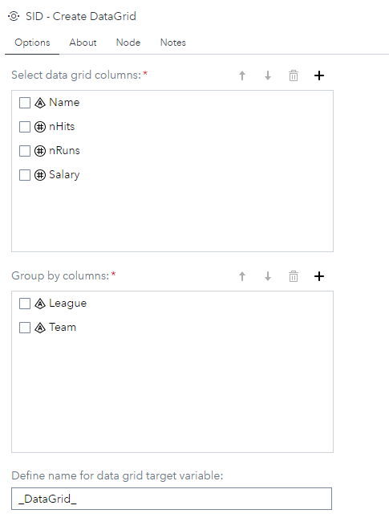
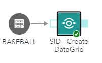

# SID - Create Data Grid

## Description

This custom step allow the user serialize source data into a data grid variable using DCM_SERIALIZEGRID macro function. 
A data grid variable is a variable of type DATAGRID whose value is a table stored in a Json format as below :

<kbd></kbd>

These data grids can then be used inside decision flows of SAS Inteligent decisioning and treated as embedded tables inside each processed record. 
You will be able to execute a model, rule set, or subdecision against each row of your datagrid or simply iterate on each row via datagrid functions. 

More information about data grid usage in SAS Intelligent Decisioning : https://go.documentation.sas.com/doc/en/edmcdc/default/edmdatagrids/p1x00nj2uyxez7n14kl0bbt4mw9c.htm

## User Interface

### Options tab ###

   * From source table, select the columns to be serialized into the data grid.
   * From source table, select the columns with class variables that will determine how the data is grouped into the data grid. If you specify one columns, the target table contains one data grid for each value of the class variable. If you specify more than one column, a separate data grid is created for each combination of values for the class variables. The class variables columns are also written to the output target tables.
   * Specifies the name for the serialized data grid column in the target table. 

   <kbd></kbd>

## Requirements

* Tested on Viya version Stable 2024.12

* Uses : DCM_SERIALIZEGRID macro (https://go.documentation.sas.com/doc/en/edmcdc/default/edmdatagrids/n16ywg120fchftn1fxqdw245jax5.htm)

## Usage

   * Can be used in a flow or as a stand alone step. 

   <kbd></kbd>

   * Requires a source table with columns to be serialized into the data grid and at least one class variable column for the results to be grouped by. 

   * If you are working with SAS Cloud Analytic Services (CAS) tables, all of the tables must be accessed in the same CAS session.

   * If the target table is a SAS dataset, the data grid target column has by default a maximum length of 32,767.
   * If the target table is a CAS table, the data grid target column has by default a maximum length of 10,485,760.
      * If a generated datagrid is longer than these respective lengths, truncation will occur. 
      * If a generated datagrid is truncated, an error message will be issued by the macro fonction, as well as a warning for each problematic row.
      * Note that the DCM_SERIALIZEGRID does not trim properly the character variables, this may lead to unexpected truncated datagrid if input columns length are big. 
	    Best practice is to reduce the max length of each column to be serialized. 
		
   * All remaining trailing blanks in serilized character columns into the datagrid are removed by a post process. 

   * Basic data grid validation for unbalanced brackets is performed. The "valid_datagrid" flag contains the return code of this validation (1 = valid, 0 = invalid). 

## Change Log

* Version 1.0 (30DEC2024)
    * Initial version 

