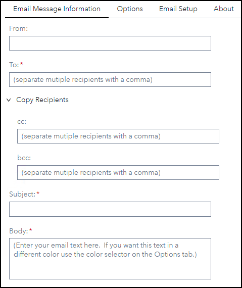
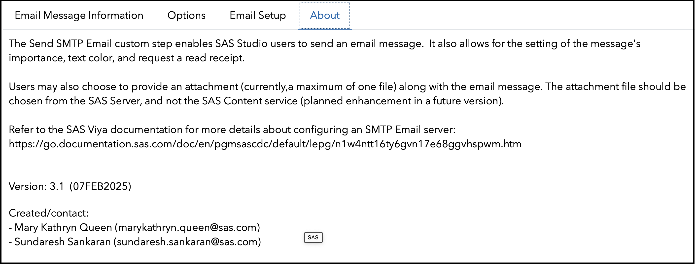

# Send SMTP Email

## Description

The "**Send SMTP Email**" Custom Step enables SAS Studio users to send an email message.  It also allows for the setting of the message's importance, adding an attachment, text color, and request a read receipt.

For more information, please refer to [this article](https://communities.sas.com/t5/SAS-Communities-Library/SAS-Viya-Send-Email-Custom-Step-Featuring-the-Color-Picker/ta-p/839499).

Note that attachment chosen should reside in a folder on the SAS Server, and the not the SAS Content service. Support for files on SAS Content is planned in future.

## User Interface

### Email Message Information tab
(Copy Recipients section collapsed)

   

(Copy Recipients section expanded)

   

<br>

### Options tab

   

### Email Setup tab

   

<br>

### About tab

   

## Requirements

* Viya 2022.1.4 or later
* SMTP Host and Port information
* To email address
* Email subject
* Email body
* Email importance - default is *Normal*

Refer to the SAS Viya documentation for more details about configuring an SMTP Email server: https://go.documentation.sas.com/doc/en/pgmsascdc/default/lepg/n1w4ntt16ty6gvn17e68ggvhspwm.htm

<br>

## Usage


<br>
----
## Run-time Control

Note: Run-time control is optional.  You may choose whether to execute the main code of this step or not, based on upstream conditions set by earlier SAS programs.  This includes nodes run prior to this custom step earlier in a SAS Studio Flow, or a previous program in the same session.

Refer this blog (https://communities.sas.com/t5/SAS-Communities-Library/Switch-on-switch-off-run-time-control-of-SAS-Studio-Custom-Steps/ta-p/885526) for more details on the concept.

The following macro variable,
```sas
_sse_run_trigger
```

will initialize with a value of 1 by default, indicating an "enabled" status and allowing the custom step to run.

If you wish to control execution of this custom step, include code in an upstream SAS program to set this variable to 0.  This "disables" execution of the custom step.

To "disable" this step, run the following code upstream:

```sas
%global _sse_run_trigger;
%let _sse_run_trigger =0;
```

To "enable" this step again, run the following (it's assumed that this has already been set as a global variable):

```sas
%let _sse_run_trigger =1;
```


IMPORTANT: Be aware that disabling this step means that none of its main execution code will run, and any  downstream code which was dependent on this code may fail.  Change this setting only if it aligns with the objective of your SAS Studio program.

----
## SAS Program & Prompt UI

Refer [here](./extras/) for the SAS program and the Prompt UI components (in json format) used by the step.  You'd find this useful for situations where you wish to execute this step through non-SAS Studio Custom Step interfaces such as the [SAS Extension for Visual Studio Code](https://github.com/sassoftware/vscode-sas-extension), with minor modifications. The Prompt UI components would come in useful in case you wish to design a job which can be execution through the SAS Job Execution Service. 

----
## Installation & Usage

- Refer to the [steps listed here](https://github.com/sassoftware/sas-studio-custom-steps#getting-started---making-a-custom-step-from-this-repository-available-in-sas-studio).

----
## Created / Contact
- Mary Kathryn Queen (marykathryn.queen@sas.com)
- Sundaresh Sankaran (sundaresh.sankaran@sas.com)


## Change Log

* Version 3.1 (07FEB2025)
    * Email Attachment Functionality for files on SAS Server. Code refactoring.
* Version 2.0 (03APR2023)
    * Updated code to clear emailBody_count macro
* Version 1.0 (17OCT2022)
    * Initial version